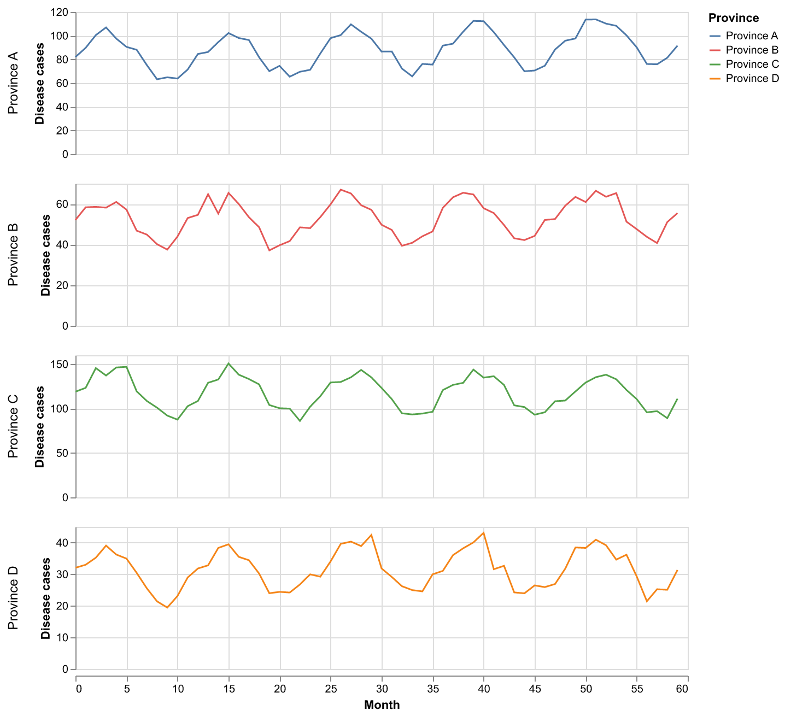
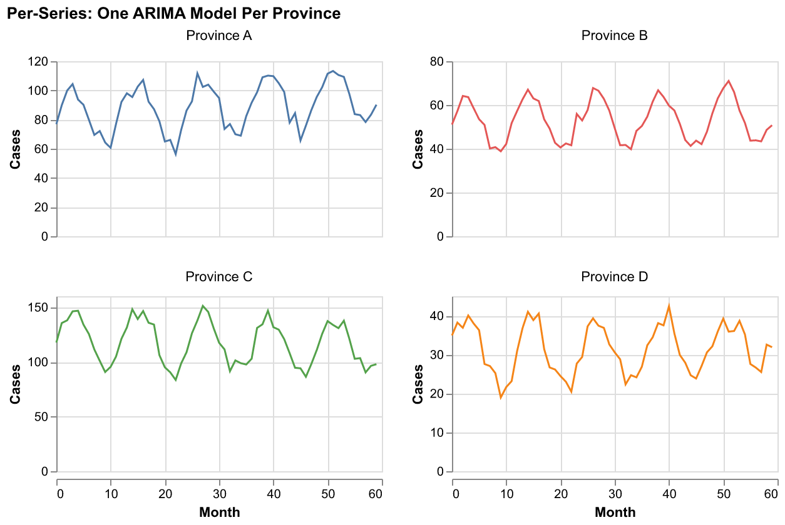
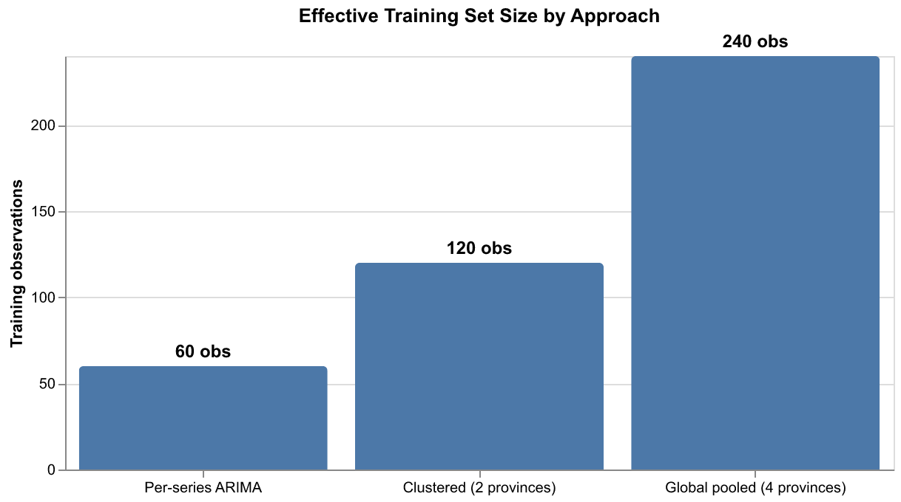
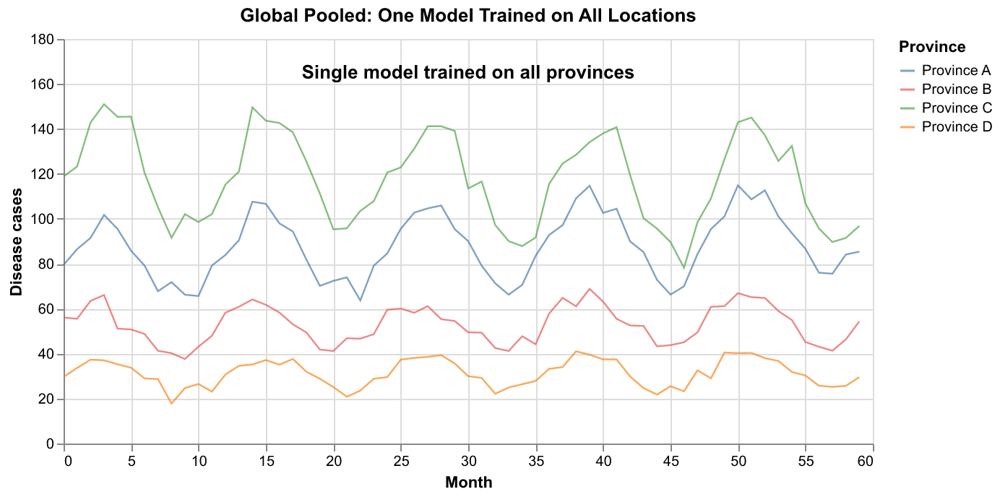
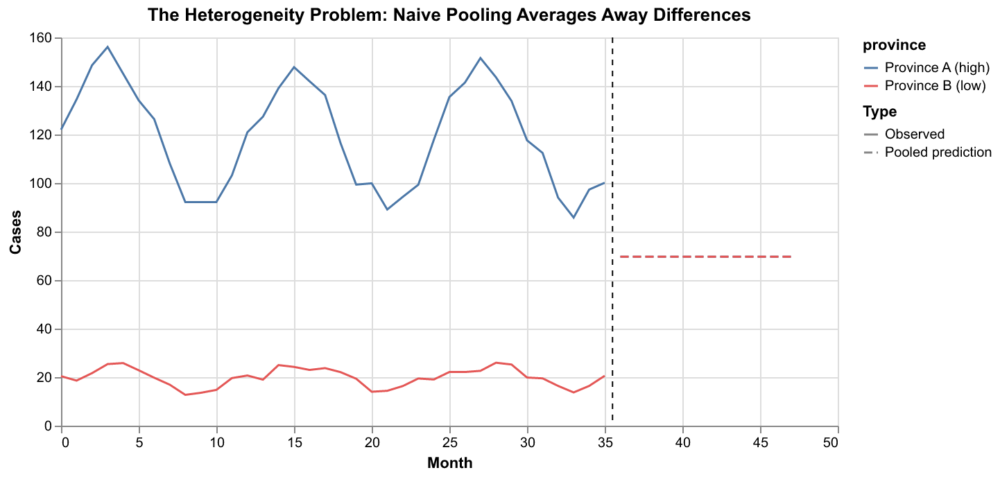
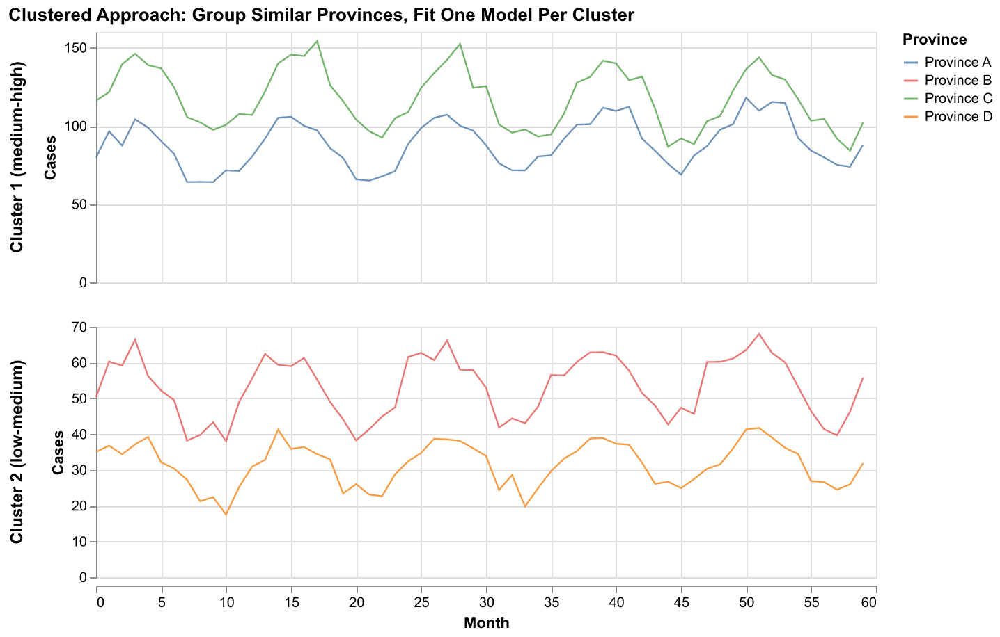
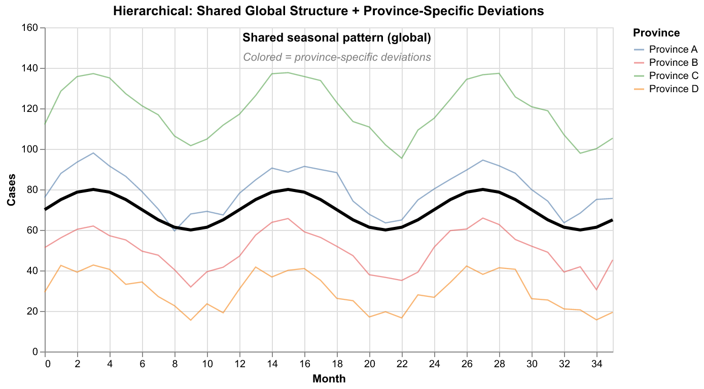
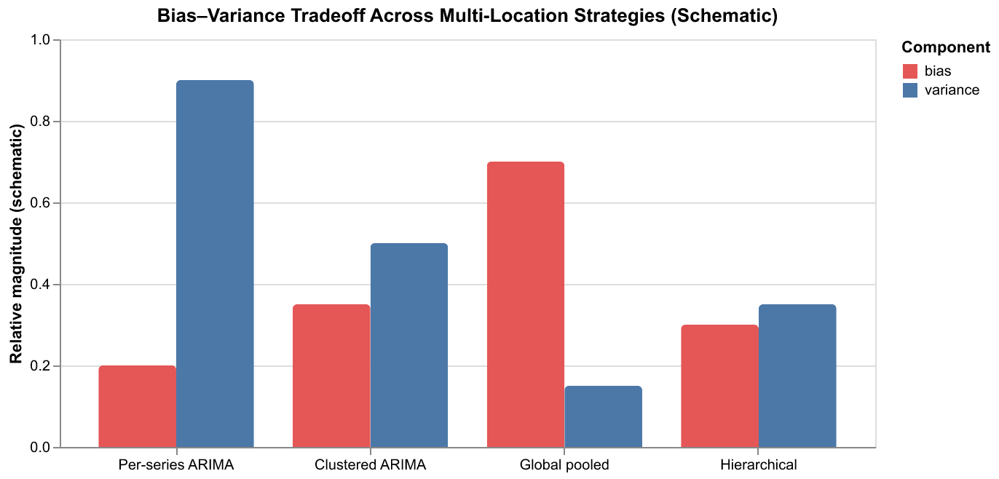

# Training ARIMA-like Models Across Multiple Locations

When modeling disease incidence across many provinces or districts within a country, a central question arises: **how should you handle the fact that you have many related but distinct time series?**

Each province has its own baseline level, its own trend, and potentially its own response to drivers like temperature or rainfall. Yet the provinces share a country, a climate zone, and often similar epidemiological dynamics. This document describes the main strategies for dealing with this, from fully separate models to fully pooled approaches, and the tradeoffs between them.



The four provinces above share a common seasonal rhythm but differ in level (Province C has ~120 cases/month, Province D has ~30), trend, and noise. Any modeling strategy must decide how to handle these similarities and differences.

---

## 1. Per-Series ARIMA: One Model Per Province

The simplest approach: fit a completely separate ARIMA model for each province.



Each province gets its own AR coefficients, its own differencing order, its own MA terms. The model for Province A knows nothing about Province B.

**How it works with ARIMA:**

```
Province A:  ARIMA(2,1,1) with φ₁=0.6, φ₂=-0.2, θ₁=0.3
Province B:  ARIMA(1,1,0) with φ₁=0.4
Province C:  ARIMA(2,1,1) with φ₁=0.5, φ₂=-0.1, θ₁=0.4
Province D:  ARIMA(1,0,1) with φ₁=0.3, θ₁=0.2
```

Each province can even have a different model *order* — Province A might need two AR terms while Province D needs only one.

**Advantages:**
- Maximum flexibility — each province is modeled exactly as its data dictates
- No risk of one province's patterns contaminating another's predictions
- Model selection (choosing p, d, q) can be automated per series (e.g. using AIC)

**Disadvantages:**
- Each model trains on only one province's data. With 60 months of data, that's 60 observations per model — often too few to reliably estimate complex seasonal ARIMA parameters
- Provinces with sparse or noisy data get poor models, with no way to "borrow" information from better-observed neighbors
- You must fit, tune, and maintain N separate models



For the CHAP setting, where data series may only be 5–10 years of monthly observations, the limited sample size is a serious concern for per-series ARIMA.

---

## 2. Global Pooled: One Model on All Locations

The opposite extreme: stack all provinces into a single training set and fit one model.



This is what the **multistep model** in this codebase does. The `fit_multi` method stacks all (location, time) pairs into a single feature matrix:

```python notest
features_stacked = features.stack(sample=("location", "time"))
y_stacked = y_target.stack(sample=("location", "time"))
one_step_model.fit(features_stacked.values, y_stacked.values)
```

With 4 provinces and 60 months, the model trains on 240 observations instead of 60. With 30 provinces, it trains on 1,800.

**How this works with ARIMA-like models:**

You cannot directly "pool" classical ARIMA because ARIMA operates on a single time series. But the lag-based regression view makes pooling natural:

```
Row from Province A, month 13:  [y_A(12), y_A(11), y_A(10)] → y_A(13)
Row from Province B, month 13:  [y_B(12), y_B(11), y_B(10)] → y_B(13)
...all stacked into one training set...
```

The model learns a single function `f(lags) → prediction` that applies to all provinces.

**Advantages:**
- Much larger effective training set — crucial when individual series are short
- The model learns general patterns shared across all provinces
- Simpler: one model to fit, tune, and maintain

**Disadvantages:**
- Assumes all provinces follow the **same** relationship between lags and future values
- If Province C has 120 cases and Province D has 30, the model may compromise — predicting something reasonable on average but wrong for both extremes

### The heterogeneity problem



When provinces are very different in scale, a naive pooled model can predict the grand mean rather than location-appropriate values. The dashed lines show a pooled model predicting ~70 for both provinces when the true values are ~120 and ~20.

### Mitigations within the pooled approach

The multistep model addresses this in several ways:

1. **Target transforms** (log, standardize): transforming cases before pooling can reduce scale differences. If Province A has 120 cases and Province D has 30, log-transforming makes these 4.8 and 3.4 — much closer together.

2. **Lag features carry the level**: because the model uses `y(t-1), y(t-2), ...` as features, a province with a high level *will have high lag values*, naturally steering predictions higher. The model doesn't just predict a global mean — it predicts conditional on recent values.

3. **Exogenous covariates**: location-specific covariates (temperature, population density) help the model distinguish provinces.

Point 2 is worth emphasizing: the lag-based regression approach handles the heterogeneity problem much better than it might seem at first glance. A province that has been running at 120 cases will have lags around 120, which naturally produces predictions around 120. The pooling assumption is really about the *dynamics* (how y responds to its own lags and covariates), not the *level*.

---

## 3. Clustered: Group Similar Provinces

A middle ground: cluster provinces by similarity, then fit one model per cluster.



Provinces A and C (medium-to-high cases) share one model; Provinces B and D (low-to-medium) share another. Each cluster model trains on more data than a per-series model, but doesn't have to reconcile very different dynamics.

**Clustering criteria might include:**
- Mean case count level
- Seasonal amplitude
- Climate zone or geographic proximity
- Correlation between time series
- Feature similarity (DTW distance, cross-correlation)

**Advantages:**
- More data per model than per-series, less heterogeneity than global pooling
- Can capture the fact that highland provinces behave differently from lowland ones

**Disadvantages:**
- Requires choosing the number of clusters and the clustering method
- Province assignment is hard — a province could fit multiple clusters
- Cluster boundaries are arbitrary — Province B with 50 cases might be more like Province A (80 cases) than Province D (30 cases), or not

**For ARIMA:** You can fit a single ARIMA model per cluster by stacking the series within each cluster (using the lag-regression formulation) or by averaging the per-series ARIMA coefficients within a cluster.

---

## 4. Hierarchical / Mixed-Effects Models

The most principled approach: explicitly decompose each province's behavior into **shared** and **province-specific** components.



The black line shows a shared seasonal pattern learned from all provinces. Each colored province deviates from this shared pattern according to its own local effects. The model learns both levels simultaneously.

**How this works conceptually:**

```
y_province(t) = μ_global + seasonal_global(t) + μ_province + seasonal_province(t) + ε(t)
              ╰─────────── shared ──────────╯   ╰────── province-specific ──────╯
```

The shared components are estimated from all data (strong signal), while province-specific deviations are estimated from each province's data alone (but regularized toward zero).

**In the ARIMA framework, this translates to:**

- **Shared AR/MA coefficients** — the temporal dynamics that are common across provinces (e.g. "outbreaks take about 3 months to decay")
- **Province-specific intercepts** — different baseline levels
- **Province-specific seasonal amplitudes** — Province C has stronger seasonality than Province D
- **Optionally, province-specific AR coefficients** — if dynamics truly differ

**Statistical frameworks for this include:**
- Mixed-effects regression with AR errors
- Bayesian structural time series with hierarchical priors
- State-space models with shared transition matrices and location-specific observation models

**Advantages:**
- Best of both worlds: borrows strength across provinces while respecting differences
- Provinces with sparse data get "pulled" toward the global pattern (regularization)
- Explicit decomposition is interpretable

**Disadvantages:**
- More complex to implement and fit than the other approaches
- Requires choosing which components are shared and which are local
- Bayesian versions can be computationally expensive
- Standard ARIMA software (e.g. `statsmodels`, `pmdarima`) doesn't natively support this — you need specialized tools (e.g. `pymc`, `stan`, `orbit`)

---

## 5. Bias–Variance Tradeoff

The four approaches sit along a bias–variance spectrum:



- **Per-series ARIMA**: Low bias (each model is perfectly tailored to its province), but high variance (limited data per model means unstable estimates)
- **Clustered ARIMA**: Moderate bias and variance — a compromise
- **Global pooled**: Low variance (lots of data), but high bias if provinces truly differ in their dynamics
- **Hierarchical**: Achieves low bias *and* low variance by explicitly modeling both shared and local structure — but at the cost of model complexity

---

## 6. What the Multistep Model Does

The multistep model in this codebase uses the **global pooled** approach with several design choices that mitigate the pooling bias:

1. **Lag features as implicit location encoding**: Because `y(t-1)` carries the province's recent level, the model naturally conditions on "where this province has been", not just a global average.

2. **Optional target transforms** (`log_transform_target`, `standardize_target`): Reduce scale differences across provinces before pooling.

3. **Exogenous covariates**: Province-specific climate variables help the model distinguish locations.

4. **Non-linear ML regressor**: Unlike a pooled linear AR model (which would learn one set of coefficients for all provinces), a tree-based model like Gradient Boosting can learn *different* dynamics in different regions of the feature space. If Province A's lags are around 100 and Province D's are around 30, the tree can learn different split rules for each regime — effectively behaving like a non-parametric hierarchical model.

This last point is subtle but important: **a pooled tree model is less "pooled" than a pooled linear model**, because the tree can partition the data internally and learn location-specific behavior without being told to.

---

## 7. Practical Recommendations

| Situation | Recommended approach |
|-----------|---------------------|
| Few locations, long series (>10 years monthly) | Per-series ARIMA works well |
| Many locations, short series (<5 years) | Global pooled or hierarchical — you need the extra data |
| Locations are very heterogeneous | Clustered or hierarchical — pure pooling will be biased |
| Locations are fairly similar | Global pooled — simplest and effective |
| You need principled uncertainty and have modeling expertise | Hierarchical / Bayesian |
| You want a practical, maintainable system | Global pooled with ML (the multistep approach) |

For the typical CHAP disease forecasting setting — **many provinces, moderate-length series, similar but not identical dynamics** — the global pooled approach with a flexible ML model (as implemented in the multistep adaptor) is a strong practical choice. It gains statistical power from pooling while letting the non-linear model adapt to location-specific patterns through the lag features and covariates.

---

## Regenerating Illustrations

```bash
uv run python docs/scripts/generate_multi_location_illustrations.py
```
