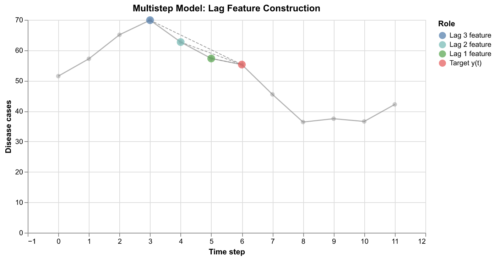
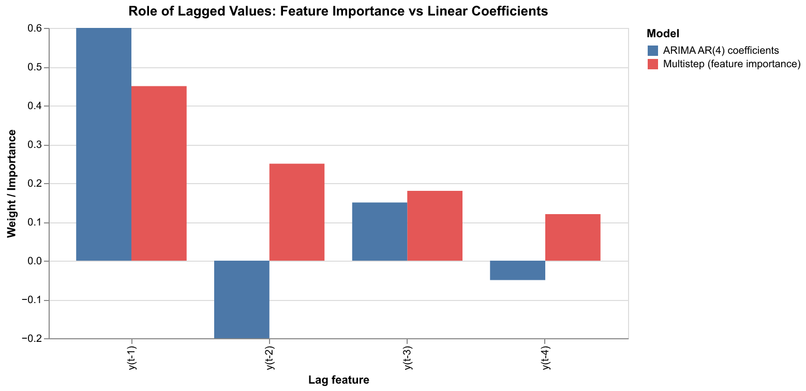
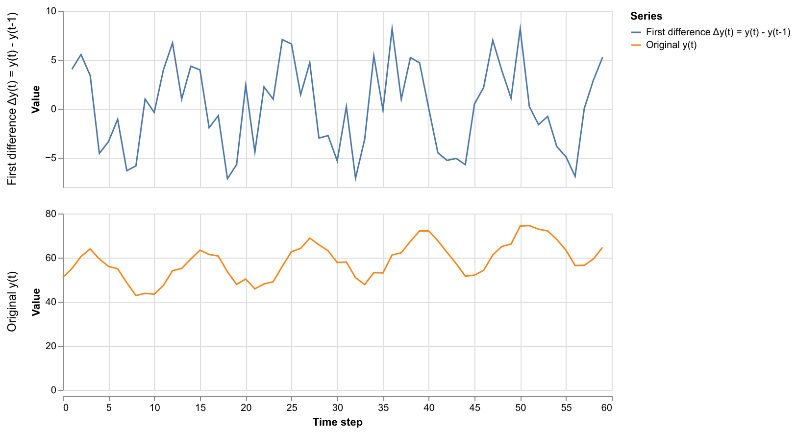
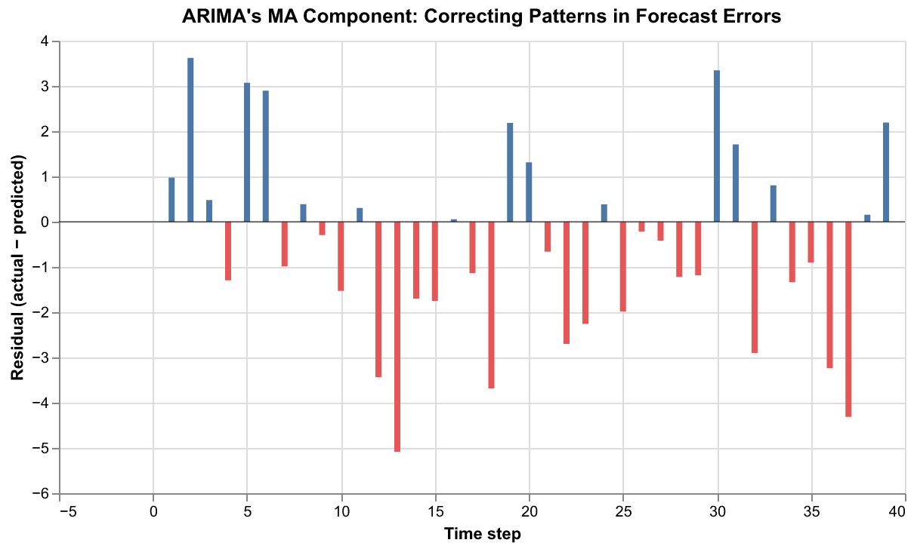
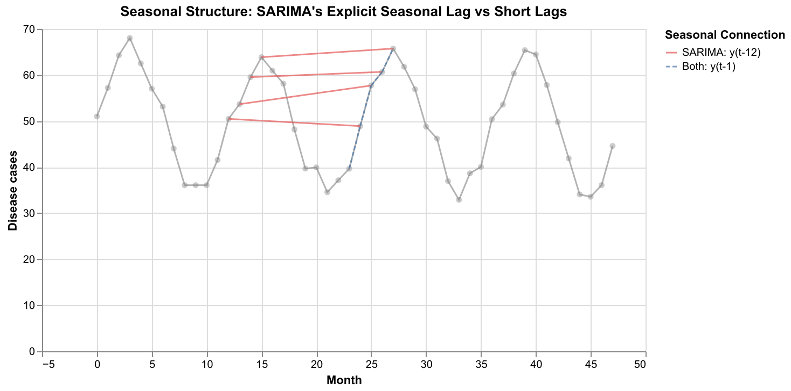
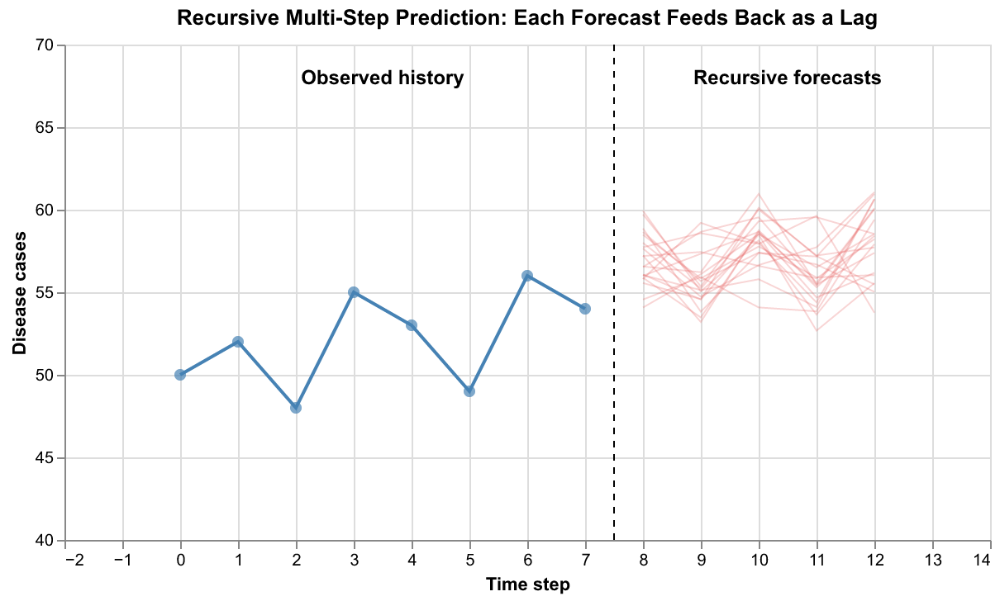
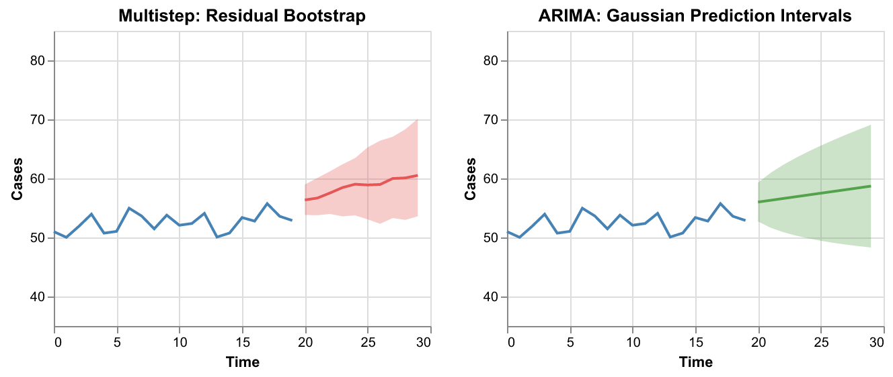

# Multistep Recursive Regression vs (S)ARIMA(X)

This document explains the key differences between the **auto-regressive recursive regression** approach implemented in the multistep adaptor and the classical **(S)ARIMA(X)** family of time series models. It assumes familiarity with the multistep model and introduces SARIMA concepts by contrasting them against it.

Both approaches share a common idea: **use past values to predict the future**. But they differ fundamentally in *how* past values are used, *what structure* is imposed, and *where uncertainty comes from*.

---

## 1. The Shared Starting Point: Lagged Target Values

Both models use previous observations of the target variable (e.g. disease cases) to make forecasts. If we are predicting `y(t)`, both look backwards at `y(t-1), y(t-2), ...` etc.

The multistep model constructs these as **explicit feature columns** in a matrix that is fed to an ML regressor (e.g. Gradient Boosting):



Each row in the training data contains the target `y(t)` and a set of lagged values `y(t-1), y(t-2), ..., y(t-k)` as input features. The ML model then learns an arbitrary mapping:

```
ŷ(t) = f(y(t-1), y(t-2), ..., y(t-k), x₁(t), x₂(t), ...)
```

where `f` can be any non-linear function the regressor learns, and `x₁, x₂, ...` are optional exogenous covariates (temperature, rainfall, etc.).

**ARIMA's AR component** does the same thing, but constrains `f` to be a **linear combination**:

```
ŷ(t) = φ₁·y(t-1) + φ₂·y(t-2) + ... + φₚ·y(t-p) + constant
```

The coefficients `φ₁, φ₂, ...` are estimated to satisfy stationarity constraints (the system must be stable and not explode).



**Key difference:** In the multistep model, the relationship between lags and the target can be *non-linear* — a tree model might learn "if `y(t-1) > 80` and `y(t-2) < 40` then predict a spike". ARIMA can only learn fixed linear weights for each lag.

---

## 2. Stationarity: Raw Values vs Differencing

The multistep model works with **raw lag values** directly. If the series has a trend (e.g. cases increasing over time due to population growth), the ML model simply learns that pattern from the data.

ARIMA takes a different approach through its **I (Integrated)** component. Before fitting, the series is *differenced* to remove trends:

```
Δy(t) = y(t) - y(t-1)       ← first difference
Δ²y(t) = Δy(t) - Δy(t-1)   ← second difference (removes quadratic trends)
```

The AR model is then fit to the differenced series, and predictions are un-differenced to get back to the original scale.



The top panel shows a trending, seasonal series. The bottom panel shows the first-differenced version — the trend is gone and the series fluctuates around zero. ARIMA models this stationary differenced series, while the multistep model works directly on the original values.

**Why this matters:** Differencing forces a specific structural assumption — that the trend can be removed by subtracting consecutive values. The multistep model makes no such assumption, which gives it flexibility but also means it relies on the ML model to extrapolate trends correctly (which tree models in particular can struggle with).

---

## 3. The MA Component: Something the Multistep Model Doesn't Have

This is perhaps the most important conceptual difference. ARIMA has a **Moving Average (MA)** component that has no direct equivalent in the multistep model.

The MA component models the target as a function of **past forecast errors**:

```
y(t) = μ + ε(t) + θ₁·ε(t-1) + θ₂·ε(t-2) + ... + θ_q·ε(t-q)
```

where `ε(t-1), ε(t-2), ...` are the errors from previous one-step-ahead predictions. The idea is: if the model under-predicted yesterday, the MA term can *correct* for that pattern systematically.



If you see that residuals have a pattern (e.g. a positive residual tends to be followed by another positive residual), the MA component can capture that. It's a form of **error correction** built directly into the model.

The multistep model does **not** model error structure. Its residuals are treated as exchangeable (i.i.d.) — during prediction, a random historical residual is added for uncertainty, but no attention is paid to *which* residuals came before. This is fundamentally different from the MA approach.

| Aspect | Multistep Model | ARIMA |
|--------|----------------|-------|
| Uses past *values*? | Yes, as features | Yes, via AR terms |
| Uses past *errors*? | No | Yes, via MA terms |
| Error model | Residual bootstrap (i.i.d.) | Structured (MA coefficients) |

---

## 4. Seasonal Structure

### SARIMA's explicit seasonal terms

The Seasonal ARIMA (SARIMA) extension adds a second set of AR and MA terms that operate at the **seasonal period**. For monthly data with yearly seasonality (period `s=12`):

```
SARIMA(p,d,q)(P,D,Q)₁₂
```

- `P`: Seasonal AR order — uses `y(t-12), y(t-24), ...`
- `D`: Seasonal differencing — `Δ₁₂y(t) = y(t) - y(t-12)`
- `Q`: Seasonal MA order — uses `ε(t-12), ε(t-24), ...`

This means SARIMA explicitly connects time points that are **one full season apart**:



The solid red lines show the seasonal lag (y(t-12)) — connecting each month to the same month last year. This is a *structured* way to handle seasonality.

### The multistep model's approach

The multistep model handles seasonality in two ways:

1. **Enough lags:** Setting `n_target_lags=12` or higher means the lag window reaches back to the same season. But unlike SARIMA, the model doesn't *know* that lag 12 is special — the ML model has to discover that from data.

2. **Exogenous features:** Seasonal drivers like temperature or rainfall can be passed as covariates. These implicitly encode seasonal information without needing long lag windows.

---

## 5. Recursive Multi-Step Forecasting

Both models share the recursive prediction strategy: to forecast multiple steps ahead, each one-step prediction is fed back as input for the next step.



At each step:
1. Use the current lag window to predict `ŷ(t+1)`
2. Shift the lag window: drop the oldest value, append `ŷ(t+1)`
3. Use the updated lag window to predict `ŷ(t+2)`
4. Repeat

This is identical in both approaches. Errors compound over the horizon in both cases — an early mistake propagates through all subsequent predictions.

---

## 6. Uncertainty Quantification

The two approaches differ markedly in how they produce prediction intervals.



**Multistep model — Residual Bootstrap:**
- After fitting, store the training residuals `e_i = y_i - ŷ_i`
- At each recursive step, sample a random residual and add it to the point prediction
- Repeat to generate many trajectories → the spread of trajectories gives the prediction interval
- Intervals can be **asymmetric** if the residual distribution is skewed

**ARIMA — Parametric Gaussian:**
- Assumes errors follow a normal distribution: `ε(t) ~ N(0, σ²)`
- Derives prediction intervals analytically using the MA representation of the model
- Intervals are always **symmetric** and grow with the square root of the forecast horizon
- The MA structure means the interval accounts for error autocorrelation

---

## 7. Exogenous Variables (the X)

Both SARIMAX and the multistep model support exogenous covariates, but in different ways:

**Multistep model:** Covariates (temperature, rainfall, etc.) are simply additional columns in the feature matrix alongside the lags. The ML model can learn arbitrary interactions between covariates and lagged targets — for example, "high temperature combined with recent increase in cases → predict a larger spike."

**SARIMAX:** Covariates enter as a *linear regression* added to the ARIMA structure:

```
y(t) = β₁·x₁(t) + β₂·x₂(t) + ... + ARIMA_errors(t)
```

The relationship between covariates and the target must be linear, and the covariates don't interact with the AR/MA dynamics (they are separate additive terms).

---

## 8. Summary Comparison

| Aspect | Multistep Recursive Regression | (S)ARIMA(X) |
|--------|-------------------------------|-------------|
| **Lag usage** | Non-linear features in ML model | Linear AR coefficients |
| **Trend handling** | Learned from raw data | Explicit differencing (I) |
| **Error modeling** | None (i.i.d. residuals) | MA terms model error patterns |
| **Seasonality** | Via enough lags or covariates | Explicit seasonal AR/MA/differencing |
| **Exogenous variables** | Arbitrary interactions | Linear additive effect |
| **Uncertainty** | Residual bootstrap (flexible) | Gaussian intervals (analytical) |
| **Model class** | Non-parametric (trees, etc.) | Parametric (linear) |
| **Interpretability** | Feature importances | Explicit coefficients |
| **Risk** | May not extrapolate trends well | May miss non-linear dynamics |

### When to prefer each

**Multistep model** tends to work well when:
- Relationships between predictors and target are non-linear
- Good exogenous covariates are available
- There is enough training data for the ML model to learn patterns
- The data generating process doesn't have strong error autocorrelation

**(S)ARIMA(X)** tends to work well when:
- The series is well-described by linear dynamics
- There is strong temporal error structure that MA terms can exploit
- Data is limited (fewer parameters to estimate)
- You need analytically derived prediction intervals

---

## Regenerating Illustrations

To regenerate the illustrations in this document:

```bash
uv run python docs/scripts/generate_multistep_vs_sarima_illustrations.py
```
