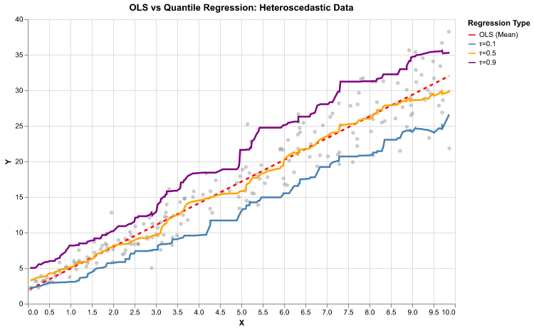
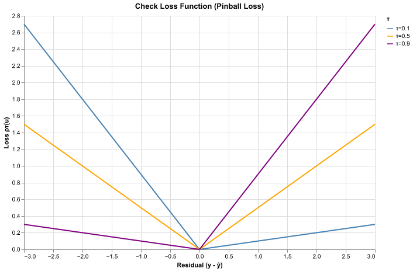
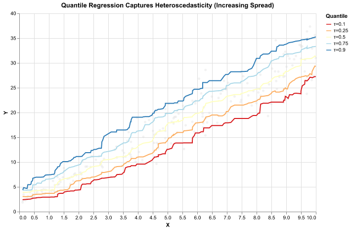
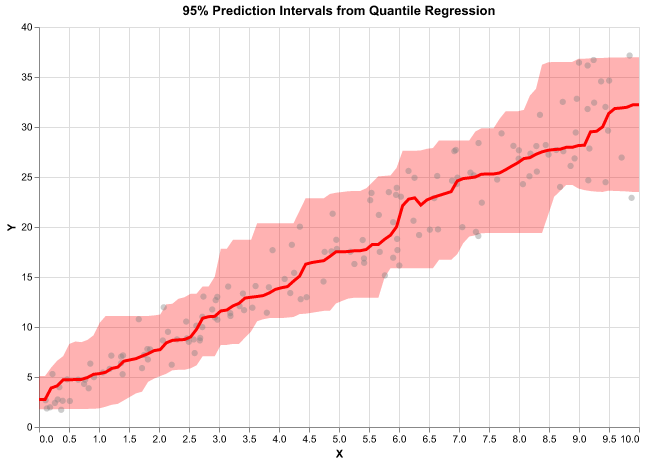
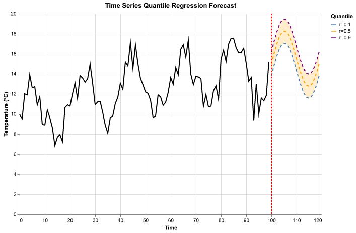
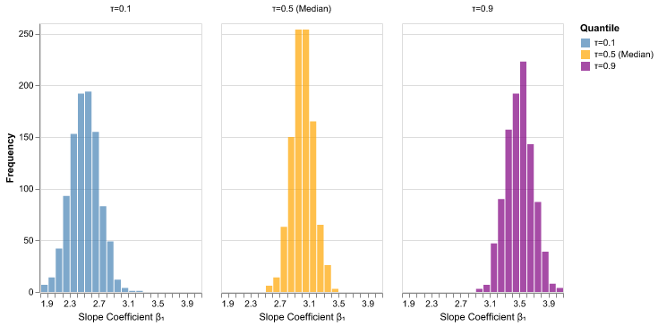
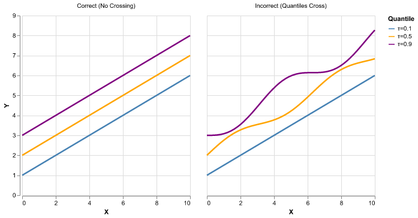
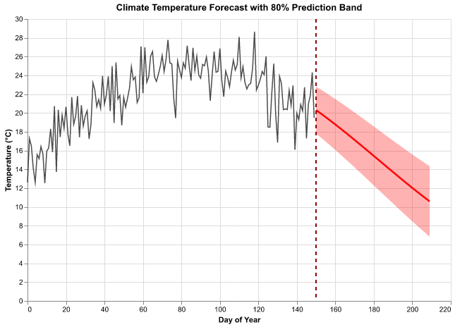
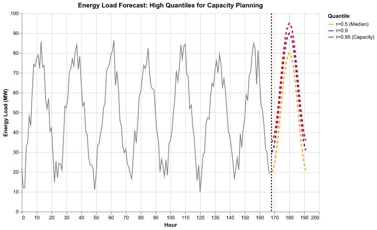
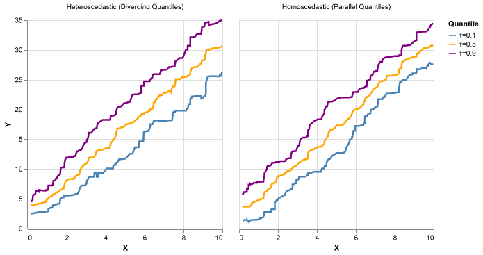

# Quantile Regression for Time Series

## Table of Contents

1. [Introduction](#introduction)
2. [Why Quantile Regression?](#why-quantile-regression)
3. [Mathematical Foundation](#mathematical-foundation)
4. [Comparison with OLS](#comparison-with-ols)
5. [Implementation](#implementation)
6. [Quantile Regression for Time Series](#quantile-regression-for-time-series)
7. [Bootstrap Inference](#bootstrap-inference)
8. [Crossing Quantiles Problem](#crossing-quantiles-problem)
9. [Applications](#applications)
10. [Best Practices](#best-practices)

## Introduction

**Quantile regression** extends classical regression by modeling conditional quantiles instead of conditional means. While Ordinary Least Squares (OLS) estimates the conditional mean E[Y|X], quantile regression estimates the conditional quantile Q_τ(Y|X) for any quantile level τ ∈ (0,1).

This is particularly valuable for:
- **Heteroscedastic data** where variance changes with predictors
- **Asymmetric distributions** where mean is not representative
- **Tail behavior** when extreme values matter (e.g., floods, heatwaves)
- **Uncertainty quantification** providing prediction intervals
- **Risk assessment** focusing on specific quantiles (e.g., 90th percentile)

## Why Quantile Regression?

### The Problem with Mean Regression

OLS regression assumes:
1. Homoscedasticity (constant variance)
2. Symmetric errors
3. Interest only in the conditional mean

These assumptions often fail in real-world time series:



### Real-World Example: Temperature Forecasting

When predicting temperature:
- OLS gives mean prediction: "Expected temperature is 25°C"
- Quantile regression gives distributional information:
  - 10th percentile: "90% chance temperature exceeds 20°C"
  - 50th percentile: "Median temperature is 25°C"
  - 90th percentile: "Only 10% chance temperature exceeds 30°C"

This is crucial for decision-making (agriculture, energy planning, public health).

## Mathematical Foundation

### The Quantile Function

For a random variable Y with CDF F(y), the τ-th quantile is:

Q_τ(Y) = F^(-1)(τ) = inf{y : F(y) ≥ τ}

For example:
- τ = 0.5: median
- τ = 0.25, 0.75: quartiles
- τ = 0.10, 0.90: deciles

### The Check Loss Function

Quantile regression minimizes the **check loss** (also called pinball loss):

ρ_τ(u) = u(τ - I(u < 0))

where I(·) is the indicator function. This can be written as:

```python notest
def check_loss(y_true, y_pred, tau):
    """
    Compute the check loss (pinball loss) for quantile regression.

    Parameters
    ----------
    y_true : array-like
        True values
    y_pred : array-like
        Predicted values
    tau : float
        Quantile level (0 < tau < 1)

    Returns
    -------
    float
        Mean check loss
    """
    residual = y_true - y_pred
    return np.mean(np.maximum(tau * residual, (tau - 1) * residual))
```

The check loss is:
- **Asymmetric**: different penalties for over/under-prediction
- **Piecewise linear**: robust to outliers (unlike squared loss)
- **Convex**: ensures unique solution for linear models



### The Optimization Problem

For linear quantile regression, we solve:

β̂_τ = argmin_β Σᵢ ρ_τ(yᵢ - xᵢᵀβ)

This is a linear programming problem (no closed-form solution like OLS).

## Comparison with OLS

### Loss Functions

**OLS** minimizes squared loss:
L(β) = Σᵢ (yᵢ - xᵢᵀβ)²

**Quantile regression** minimizes check loss:
L_τ(β) = Σᵢ ρ_τ(yᵢ - xᵢᵀβ)

### Key Differences

| Aspect | OLS | Quantile Regression |
|--------|-----|---------------------|
| Target | Conditional mean E[Y\|X] | Conditional quantile Q_τ(Y\|X) |
| Loss | Squared (ℓ₂) | Check/Pinball (ℓ₁-like) |
| Outlier sensitivity | High | Low (robust) |
| Heteroscedasticity | Problematic | Naturally handled |
| Computation | Closed-form | Linear programming |
| Interpretation | Average effect | Effect at specific quantile |



### Example: Income and Education

Consider predicting income from years of education:

```python notest
import numpy as np
import pandas as pd
import matplotlib.pyplot as plt
from statsmodels.regression.quantile_regression import QuantReg
from sklearn.linear_model import LinearRegression

# Generate heteroscedastic data
np.random.seed(42)
n = 500
education = np.random.uniform(8, 20, n)
# Variance increases with education
income = 20 + 5 * education + np.random.normal(0, 0.5 * education, n)

X = education.reshape(-1, 1)
y = income

# OLS regression
ols = LinearRegression()
ols.fit(X, y)
y_ols = ols.predict(X)

# Quantile regression for τ = 0.1, 0.5, 0.9
quantiles = [0.1, 0.5, 0.9]
y_quants = {}

for tau in quantiles:
    qr = QuantReg(y, np.column_stack([np.ones(n), X.ravel()]))
    result = qr.fit(q=tau)
    y_quants[tau] = result.predict(np.column_stack([np.ones(n), X.ravel()]))

# Plot
plt.figure(figsize=(10, 6))
plt.scatter(education, income, alpha=0.3, label='Data')
plt.plot(education, y_ols, 'r-', linewidth=2, label='OLS (mean)')
for tau in quantiles:
    plt.plot(education, y_quants[tau], '--', linewidth=2, label=f'τ={tau}')
plt.xlabel('Years of Education')
plt.ylabel('Income ($1000s)')
plt.legend()
plt.title('OLS vs Quantile Regression: Heteroscedastic Data')
plt.show()
```

**Observation**: OLS captures average effect, but quantile regression reveals:
- Lower quantiles (τ=0.1): returns to education are smaller
- Upper quantiles (τ=0.9): returns to education are larger
- Spread increases with education (heteroscedasticity)

## Implementation

### Using statsmodels

```python notest
import numpy as np
import pandas as pd
import statsmodels.api as sm
from statsmodels.regression.quantile_regression import QuantReg

# Generate data
np.random.seed(42)
n = 200
X = np.random.uniform(0, 10, n)
y = 2 + 3 * X + np.random.normal(0, 1 + 0.5 * X, n)  # Heteroscedastic

# Add constant for intercept
X_with_const = sm.add_constant(X)

# Fit quantile regression for median (τ=0.5)
qr_model = QuantReg(y, X_with_const)
qr_result = qr_model.fit(q=0.5)

print(qr_result.summary())

# Fit multiple quantiles
quantiles = np.arange(0.05, 1.0, 0.05)
coefs = {}

for tau in quantiles:
    result = qr_model.fit(q=tau)
    coefs[tau] = result.params

# Convert to DataFrame
coef_df = pd.DataFrame(coefs).T
coef_df.columns = ['Intercept', 'Slope']

print("\nSlope estimates across quantiles:")
print(coef_df['Slope'].describe())
```

### Using scikit-learn

```python notest
from sklearn.linear_model import QuantileRegressor

# Fit quantile regression
qr = QuantileRegressor(quantile=0.5, alpha=0, solver='highs')
qr.fit(X.reshape(-1, 1), y)

print(f"Intercept: {qr.intercept_:.3f}")
print(f"Slope: {qr.coef_[0]:.3f}")

# Predict
X_new = np.linspace(0, 10, 100).reshape(-1, 1)
y_pred = qr.predict(X_new)
```

### Building Prediction Intervals

Quantile regression naturally provides prediction intervals:

```python notest
def quantile_prediction_interval(X_train, y_train, X_new, alpha=0.05):
    """
    Compute prediction intervals using quantile regression.

    Parameters
    ----------
    X_train : array-like, shape (n_samples, n_features)
        Training features
    y_train : array-like, shape (n_samples,)
        Training target
    X_new : array-like, shape (n_new, n_features)
        New features for prediction
    alpha : float, default=0.05
        Significance level for (1-alpha) prediction interval

    Returns
    -------
    median : array, shape (n_new,)
        Median predictions
    lower : array, shape (n_new,)
        Lower bound of prediction interval
    upper : array, shape (n_new,)
        Upper bound of prediction interval
    """
    from sklearn.linear_model import QuantileRegressor

    # Fit three quantile regressors
    qr_lower = QuantileRegressor(quantile=alpha/2, alpha=0)
    qr_median = QuantileRegressor(quantile=0.5, alpha=0)
    qr_upper = QuantileRegressor(quantile=1-alpha/2, alpha=0)

    qr_lower.fit(X_train, y_train)
    qr_median.fit(X_train, y_train)
    qr_upper.fit(X_train, y_train)

    lower = qr_lower.predict(X_new)
    median = qr_median.predict(X_new)
    upper = qr_upper.predict(X_new)

    return median, lower, upper


# Example usage
np.random.seed(42)
n = 200
X_train = np.random.uniform(0, 10, n).reshape(-1, 1)
y_train = 2 + 3 * X_train.ravel() + np.random.normal(0, 1 + 0.5 * X_train.ravel(), n)

X_new = np.linspace(0, 10, 100).reshape(-1, 1)
median, lower, upper = quantile_prediction_interval(X_train, y_train, X_new)

# Plot
import matplotlib.pyplot as plt
plt.figure(figsize=(10, 6))
plt.scatter(X_train, y_train, alpha=0.3, label='Training data')
plt.plot(X_new, median, 'r-', linewidth=2, label='Median prediction')
plt.fill_between(X_new.ravel(), lower, upper, alpha=0.2, color='red', label='95% prediction interval')
plt.xlabel('X')
plt.ylabel('Y')
plt.legend()
plt.title('Quantile Regression Prediction Intervals')
plt.show()
```



## Quantile Regression for Time Series

### Temporal Dependence

When applying quantile regression to time series, we must account for:
1. **Autocorrelation** in residuals
2. **Lagged predictors** (autoregressive structure)
3. **Time-varying quantiles** (non-stationarity)

### Autoregressive Quantile Regression

Extend to include lagged values:

y_t = β₀(τ) + β₁(τ)y_{t-1} + β₂(τ)y_{t-2} + ... + ε_t

where each coefficient is quantile-specific.

```python notest
def fit_ar_quantile_regression(y, lags=1, tau=0.5):
    """
    Fit autoregressive quantile regression.

    Parameters
    ----------
    y : array-like, shape (n_samples,)
        Time series data
    lags : int, default=1
        Number of lags to include
    tau : float, default=0.5
        Quantile level

    Returns
    -------
    model : fitted QuantReg model
    X : array, lagged predictors
    y_shifted : array, shifted target
    """
    import statsmodels.api as sm
    from statsmodels.regression.quantile_regression import QuantReg

    # Create lagged features
    n = len(y)
    X_lags = []
    for lag in range(1, lags + 1):
        X_lags.append(y[lags - lag : n - lag])

    X = np.column_stack(X_lags)
    y_shifted = y[lags:]

    # Add constant
    X_with_const = sm.add_constant(X)

    # Fit quantile regression
    qr = QuantReg(y_shifted, X_with_const)
    result = qr.fit(q=tau)

    return result, X, y_shifted


# Example: AR(2) quantile regression
np.random.seed(42)
n = 300
y = np.zeros(n)
y[0] = np.random.normal(0, 1)
y[1] = np.random.normal(0, 1)

for t in range(2, n):
    y[t] = 0.5 * y[t-1] + 0.3 * y[t-2] + np.random.normal(0, 1)

# Fit for multiple quantiles
quantiles = [0.1, 0.5, 0.9]
results = {}

for tau in quantiles:
    result, X, y_shifted = fit_ar_quantile_regression(y, lags=2, tau=tau)
    results[tau] = result
    print(f"\nτ = {tau}:")
    print(f"  β₀ = {result.params[0]:.3f}")
    print(f"  β₁ = {result.params[1]:.3f}")
    print(f"  β₂ = {result.params[2]:.3f}")
```

### Quantile Regression with Exogenous Variables

Include external predictors:

```python notest
def fit_qarx_model(y, X_exog, lags=1, tau=0.5):
    """
    Fit quantile autoregressive model with exogenous variables (QARX).

    Parameters
    ----------
    y : array-like, shape (n_samples,)
        Time series target
    X_exog : array-like, shape (n_samples, n_features)
        Exogenous predictors
    lags : int, default=1
        Number of autoregressive lags
    tau : float, default=0.5
        Quantile level

    Returns
    -------
    result : fitted QuantReg model
    """
    import statsmodels.api as sm
    from statsmodels.regression.quantile_regression import QuantReg

    n = len(y)

    # Create lagged y features
    X_lags = []
    for lag in range(1, lags + 1):
        X_lags.append(y[lags - lag : n - lag])

    # Combine lags with exogenous variables
    X_combined = np.column_stack([
        np.column_stack(X_lags),
        X_exog[lags:]
    ])
    y_shifted = y[lags:]

    # Add constant
    X_with_const = sm.add_constant(X_combined)

    # Fit
    qr = QuantReg(y_shifted, X_with_const)
    result = qr.fit(q=tau)

    return result


# Example: Temperature with seasonality
np.random.seed(42)
n = 365 * 3  # 3 years of daily data
t = np.arange(n)

# Seasonal pattern
seasonality = 10 * np.sin(2 * np.pi * t / 365)

# Temperature with AR(1) structure
temp = np.zeros(n)
temp[0] = 15 + seasonality[0]

for i in range(1, n):
    temp[i] = 0.8 * temp[i-1] + 0.2 * (15 + seasonality[i]) + np.random.normal(0, 2)

# Use day of year as exogenous variable
day_of_year = (t % 365).reshape(-1, 1)
X_seasonal = np.column_stack([
    np.sin(2 * np.pi * day_of_year / 365),
    np.cos(2 * np.pi * day_of_year / 365)
])

# Fit QARX model
result_median = fit_qarx_model(temp, X_seasonal, lags=1, tau=0.5)
print(result_median.summary())
```



## Bootstrap Inference

Standard errors for quantile regression can be obtained via bootstrap.

### Residual Bootstrap for Quantile Regression

```python notest
def bootstrap_quantile_regression(X, y, tau=0.5, n_bootstrap=1000, alpha=0.05):
    """
    Bootstrap inference for quantile regression coefficients.

    Parameters
    ----------
    X : array-like, shape (n_samples, n_features)
        Features (without constant)
    y : array-like, shape (n_samples,)
        Target
    tau : float, default=0.5
        Quantile level
    n_bootstrap : int, default=1000
        Number of bootstrap samples
    alpha : float, default=0.05
        Significance level for confidence intervals

    Returns
    -------
    coef_original : array
        Original coefficient estimates
    coef_ci : array, shape (n_features+1, 2)
        Confidence intervals for coefficients
    coef_se : array
        Standard errors for coefficients
    """
    import statsmodels.api as sm
    from statsmodels.regression.quantile_regression import QuantReg

    n, p = X.shape
    X_with_const = sm.add_constant(X)

    # Fit original model
    qr = QuantReg(y, X_with_const)
    result = qr.fit(q=tau)
    coef_original = result.params

    # Bootstrap
    coef_bootstrap = np.zeros((n_bootstrap, p + 1))

    for b in range(n_bootstrap):
        # Resample observations
        idx = np.random.choice(n, size=n, replace=True)
        X_star = X[idx]
        y_star = y[idx]

        X_star_const = sm.add_constant(X_star)
        qr_star = QuantReg(y_star, X_star_const)

        try:
            result_star = qr_star.fit(q=tau)
            coef_bootstrap[b, :] = result_star.params
        except:
            # If optimization fails, use original estimates
            coef_bootstrap[b, :] = coef_original

    # Compute confidence intervals and standard errors
    coef_ci = np.percentile(coef_bootstrap, [100*alpha/2, 100*(1-alpha/2)], axis=0).T
    coef_se = np.std(coef_bootstrap, axis=0)

    return coef_original, coef_ci, coef_se


# Example
np.random.seed(42)
n = 200
X = np.random.uniform(0, 10, (n, 2))
y = 2 + 3 * X[:, 0] - 1.5 * X[:, 1] + np.random.normal(0, 2, n)

coef, ci, se = bootstrap_quantile_regression(X, y, tau=0.5, n_bootstrap=500)

print("Quantile Regression Coefficients (τ=0.5):")
print("=" * 60)
for i, name in enumerate(['Intercept', 'X1', 'X2']):
    print(f"{name:12s}: {coef[i]:7.3f} ± {se[i]:.3f}, "
          f"95% CI: [{ci[i, 0]:.3f}, {ci[i, 1]:.3f}]")
```

### Block Bootstrap for Time Series

For time series, use block bootstrap to preserve temporal dependence:

```python notest
def block_bootstrap_qr_timeseries(y, X_exog=None, lags=1, tau=0.5,
                                   block_length=10, n_bootstrap=1000):
    """
    Block bootstrap for autoregressive quantile regression.

    Parameters
    ----------
    y : array-like, shape (n_samples,)
        Time series target
    X_exog : array-like, shape (n_samples, n_features), optional
        Exogenous predictors
    lags : int, default=1
        Number of AR lags
    tau : float, default=0.5
        Quantile level
    block_length : int, default=10
        Length of blocks for block bootstrap
    n_bootstrap : int, default=1000
        Number of bootstrap samples

    Returns
    -------
    coef_original : array
        Original coefficient estimates
    coef_bootstrap : array, shape (n_bootstrap, n_coefs)
        Bootstrap coefficient estimates
    """
    import statsmodels.api as sm
    from statsmodels.regression.quantile_regression import QuantReg

    n = len(y)

    # Prepare data
    X_lags = []
    for lag in range(1, lags + 1):
        X_lags.append(y[lags - lag : n - lag])

    if X_exog is not None:
        X_combined = np.column_stack([np.column_stack(X_lags), X_exog[lags:]])
    else:
        X_combined = np.column_stack(X_lags)

    y_shifted = y[lags:]
    X_with_const = sm.add_constant(X_combined)
    n_effective = len(y_shifted)

    # Fit original
    qr = QuantReg(y_shifted, X_with_const)
    result = qr.fit(q=tau)
    coef_original = result.params

    # Block bootstrap
    n_blocks = int(np.ceil(n_effective / block_length))
    coef_bootstrap = np.zeros((n_bootstrap, len(coef_original)))

    for b in range(n_bootstrap):
        # Sample blocks
        block_starts = np.random.choice(n_effective - block_length + 1, size=n_blocks, replace=True)
        idx_star = []

        for start in block_starts:
            idx_star.extend(range(start, min(start + block_length, n_effective)))

        idx_star = idx_star[:n_effective]  # Trim to original length

        X_star = X_with_const[idx_star]
        y_star = y_shifted[idx_star]

        qr_star = QuantReg(y_star, X_star)

        try:
            result_star = qr_star.fit(q=tau)
            coef_bootstrap[b, :] = result_star.params
        except:
            coef_bootstrap[b, :] = coef_original

    return coef_original, coef_bootstrap


# Example
np.random.seed(42)
n = 300
y = np.zeros(n)
y[0] = 0

for t in range(1, n):
    y[t] = 0.7 * y[t-1] + np.random.normal(0, 1)

coef_orig, coef_boot = block_bootstrap_qr_timeseries(
    y, lags=1, tau=0.5, block_length=20, n_bootstrap=500
)

print("AR(1) Quantile Regression (τ=0.5):")
print(f"Original coefficients: {coef_orig}")
print(f"Bootstrap std errors: {np.std(coef_boot, axis=0)}")
print(f"Bootstrap 95% CI:")
ci = np.percentile(coef_boot, [2.5, 97.5], axis=0)
for i in range(len(coef_orig)):
    print(f"  β{i}: [{ci[0, i]:.3f}, {ci[1, i]:.3f}]")
```



## Crossing Quantiles Problem

A common issue: estimated quantiles may cross (e.g., Q̂₀.₉(x) < Q̂₀.₅(x)), which is theoretically impossible.



### Causes of Crossing

1. **Finite sample variation** especially with small samples
2. **Model misspecification** when true relationship is nonlinear
3. **Sparse data regions** where few observations exist
4. **Independent estimation** fitting each quantile separately

### Solutions

#### 1. Quantile Averaging

Enforce non-crossing by averaging:

```python notest
def enforce_noncrossing_average(quantile_preds):
    """
    Enforce non-crossing quantiles by isotonic regression.

    Parameters
    ----------
    quantile_preds : dict
        Dictionary mapping tau -> predictions (array)

    Returns
    -------
    corrected_preds : dict
        Corrected predictions with non-crossing guarantee
    """
    from sklearn.isotonic import IsotonicRegression

    taus = sorted(quantile_preds.keys())
    n = len(quantile_preds[taus[0]])

    corrected_preds = {}

    # For each observation, ensure monotonicity across quantiles
    for i in range(n):
        values = [quantile_preds[tau][i] for tau in taus]

        # Fit isotonic regression
        iso_reg = IsotonicRegression(increasing=True)
        corrected_values = iso_reg.fit_transform(taus, values)

        for j, tau in enumerate(taus):
            if tau not in corrected_preds:
                corrected_preds[tau] = np.zeros(n)
            corrected_preds[tau][i] = corrected_values[j]

    return corrected_preds
```

#### 2. Simultaneous Quantile Regression

Estimate all quantiles jointly with non-crossing constraints:

```python notest
def fit_noncrossing_quantiles(X, y, quantiles=[0.1, 0.5, 0.9]):
    """
    Fit multiple quantile regressions with non-crossing constraints.

    This uses linear interpolation between quantiles to ensure monotonicity.

    Parameters
    ----------
    X : array-like, shape (n_samples, n_features)
        Features
    y : array-like, shape (n_samples,)
        Target
    quantiles : list of float
        Quantile levels to estimate

    Returns
    -------
    models : dict
        Fitted quantile regression models
    """
    import statsmodels.api as sm
    from statsmodels.regression.quantile_regression import QuantReg

    X_with_const = sm.add_constant(X)
    models = {}

    # Fit quantiles in order
    sorted_quantiles = sorted(quantiles)

    for tau in sorted_quantiles:
        qr = QuantReg(y, X_with_const)
        result = qr.fit(q=tau)
        models[tau] = result

    # Check for crossings
    X_test = X_with_const
    predictions = {tau: models[tau].predict(X_test) for tau in sorted_quantiles}

    # Detect crossings
    for i in range(len(sorted_quantiles) - 1):
        tau_low = sorted_quantiles[i]
        tau_high = sorted_quantiles[i + 1]

        crossings = np.sum(predictions[tau_high] < predictions[tau_low])
        if crossings > 0:
            print(f"Warning: {crossings} crossings detected between τ={tau_low} and τ={tau_high}")

    return models
```

#### 3. Monotone Splines

Use monotone spline basis functions:

```python notest
from scipy.interpolate import PchipInterpolator

def predict_with_monotone_interpolation(X, quantile_models, tau_new):
    """
    Predict new quantile by monotone interpolation between fitted quantiles.

    Parameters
    ----------
    X : array-like
        Features for prediction
    quantile_models : dict
        Fitted quantile regression models
    tau_new : float or array-like
        New quantile level(s) to predict

    Returns
    -------
    y_pred : array
        Predicted values at tau_new
    """
    import statsmodels.api as sm

    X_with_const = sm.add_constant(X)
    taus = sorted(quantile_models.keys())

    # Get predictions for fitted quantiles
    predictions = {tau: quantile_models[tau].predict(X_with_const) for tau in taus}

    # Interpolate
    n = len(X)
    if np.isscalar(tau_new):
        tau_new = [tau_new]

    y_pred = np.zeros((len(tau_new), n))

    for i in range(n):
        values = [predictions[tau][i] for tau in taus]
        interp = PchipInterpolator(taus, values)  # Monotone cubic interpolation
        y_pred[:, i] = interp(tau_new)

    return y_pred.squeeze()
```

## Applications

### Climate Prediction

Quantile regression is ideal for climate forecasts where:
- Extremes matter (heatwaves, heavy rainfall)
- Distributional information needed
- Heteroscedasticity common

```python notest
def climate_quantile_forecast(temperature_history, predictors,
                               quantiles=[0.1, 0.5, 0.9]):
    """
    Generate quantile forecasts for temperature.

    Parameters
    ----------
    temperature_history : array-like
        Historical temperature time series
    predictors : array-like, shape (n_samples, n_features)
        Climate predictors (e.g., SST, pressure patterns)
    quantiles : list of float
        Quantile levels for forecast

    Returns
    -------
    forecasts : dict
        Quantile forecasts
    """
    import statsmodels.api as sm
    from statsmodels.regression.quantile_regression import QuantReg

    # Prepare AR features
    lags = 5
    n = len(temperature_history)

    X_lags = []
    for lag in range(1, lags + 1):
        X_lags.append(temperature_history[lags - lag : n - lag])

    # Combine with predictors
    X_combined = np.column_stack([np.column_stack(X_lags), predictors[lags:]])
    y = temperature_history[lags:]

    X_with_const = sm.add_constant(X_combined)

    # Fit quantile models
    forecasts = {}
    for tau in quantiles:
        qr = QuantReg(y, X_with_const)
        result = qr.fit(q=tau)
        forecasts[tau] = result

    return forecasts


# Visualization helper
def plot_quantile_forecast(t, y_observed, forecasts, forecast_horizon):
    """Plot historical data with quantile forecasts."""
    import matplotlib.pyplot as plt

    plt.figure(figsize=(12, 6))

    # Historical data
    plt.plot(t[:len(y_observed)], y_observed, 'k-', linewidth=1.5, label='Observed')

    # Forecast horizon
    t_forecast = np.arange(len(y_observed), len(y_observed) + forecast_horizon)

    # Plot quantile forecasts
    colors = {0.1: 'lightblue', 0.5: 'blue', 0.9: 'darkblue'}

    for tau, color in colors.items():
        if tau in forecasts:
            plt.plot(t_forecast, forecasts[tau], '--', color=color,
                    linewidth=2, label=f'τ={tau}')

    # Prediction band
    if 0.1 in forecasts and 0.9 in forecasts:
        plt.fill_between(t_forecast, forecasts[0.1], forecasts[0.9],
                        alpha=0.2, color='blue', label='80% prediction band')

    plt.xlabel('Time')
    plt.ylabel('Temperature (°C)')
    plt.title('Quantile Regression Forecast')
    plt.legend()
    plt.grid(alpha=0.3)
    plt.show()
```



### Risk Management

Quantile regression for risk assessment:

```python notest
def value_at_risk_forecast(returns, alpha=0.05):
    """
    Forecast Value at Risk (VaR) using quantile regression.

    Parameters
    ----------
    returns : array-like
        Historical returns
    alpha : float, default=0.05
        Risk level (e.g., 0.05 for 95% VaR)

    Returns
    -------
    var_forecast : float
        Value at Risk forecast
    """
    import statsmodels.api as sm
    from statsmodels.regression.quantile_regression import QuantReg

    # AR(1) model for returns
    n = len(returns)
    X = returns[:-1].reshape(-1, 1)
    y = returns[1:]

    X_with_const = sm.add_constant(X)

    # Fit lower quantile (left tail)
    qr = QuantReg(y, X_with_const)
    result = qr.fit(q=alpha)

    # Forecast VaR
    last_return = returns[-1]
    X_new = np.array([[1, last_return]])
    var_forecast = result.predict(X_new)[0]

    return var_forecast
```

### Energy Load Forecasting

Predict electricity demand quantiles for capacity planning:

```python notest
def energy_load_quantile_forecast(load_history, temperature, hour_of_day,
                                   quantiles=[0.5, 0.9, 0.95]):
    """
    Forecast energy load quantiles.

    High quantiles (0.9, 0.95) important for capacity planning
    to avoid blackouts.

    Parameters
    ----------
    load_history : array-like
        Historical load (MW)
    temperature : array-like
        Temperature forecasts
    hour_of_day : array-like
        Hour of day (0-23)
    quantiles : list of float
        Quantile levels to forecast

    Returns
    -------
    forecasts : dict
        Quantile forecasts for each level
    """
    import statsmodels.api as sm
    from statsmodels.regression.quantile_regression import QuantReg

    # Features: lagged load, temperature, hour indicators
    n = len(load_history)

    # Lag 1 and lag 24 (previous day same hour)
    X_lag1 = load_history[:-1]
    X_lag24 = load_history[:-24] if len(load_history) > 24 else load_history[:-1]

    # Align arrays
    n_samples = min(len(X_lag1), len(X_lag24), len(temperature) - 1)
    X = np.column_stack([
        X_lag1[:n_samples],
        X_lag24[:n_samples],
        temperature[1:n_samples+1],
        np.sin(2 * np.pi * hour_of_day[1:n_samples+1] / 24),
        np.cos(2 * np.pi * hour_of_day[1:n_samples+1] / 24)
    ])
    y = load_history[1:n_samples+1]

    X_with_const = sm.add_constant(X)

    # Fit quantile models
    forecasts = {}
    for tau in quantiles:
        qr = QuantReg(y, X_with_const)
        result = qr.fit(q=tau)
        forecasts[tau] = result

    return forecasts
```



## Best Practices

### 1. Choose Appropriate Quantiles

- **Symmetric intervals**: Use (0.05, 0.5, 0.95) or (0.1, 0.5, 0.9)
- **Focus on tails**: Use (0.01, 0.05, 0.1) for extreme low values
- **Risk assessment**: Use high quantiles (0.90, 0.95, 0.99)

### 2. Check for Crossing Quantiles

Always verify that Q̂_τ₁(x) < Q̂_τ₂(x) for τ₁ < τ₂.

```python notest
def check_quantile_crossings(quantile_predictions):
    """
    Check if quantile predictions cross.

    Parameters
    ----------
    quantile_predictions : dict
        Maps tau -> predictions array

    Returns
    -------
    n_crossings : int
        Number of crossing violations
    """
    taus = sorted(quantile_predictions.keys())
    n_crossings = 0

    for i in range(len(taus) - 1):
        tau_low = taus[i]
        tau_high = taus[i + 1]

        pred_low = quantile_predictions[tau_low]
        pred_high = quantile_predictions[tau_high]

        crossings = np.sum(pred_high < pred_low)
        n_crossings += crossings

        if crossings > 0:
            pct = 100 * crossings / len(pred_low)
            print(f"τ={tau_low} and τ={tau_high}: {crossings} crossings ({pct:.1f}%)")

    return n_crossings
```

### 3. Validate Coverage

Check that empirical coverage matches nominal level:

```python notest
def check_quantile_coverage(y_true, y_pred_quantile, tau):
    """
    Check if quantile predictions have correct coverage.

    For quantile τ, approximately τ * 100% of observations
    should be below the predicted quantile.

    Parameters
    ----------
    y_true : array-like
        True values
    y_pred_quantile : array-like
        Predicted τ-th quantile
    tau : float
        Quantile level

    Returns
    -------
    coverage : float
        Empirical coverage (should be close to tau)
    """
    below = np.mean(y_true < y_pred_quantile)

    print(f"τ = {tau:.2f}")
    print(f"  Expected coverage: {tau:.1%}")
    print(f"  Empirical coverage: {below:.1%}")
    print(f"  Difference: {(below - tau):.1%}")

    return below
```

### 4. Use Block Bootstrap for Time Series

Always use block bootstrap (not i.i.d. bootstrap) for time series to preserve temporal dependence.

### 5. Consider Computational Cost

Quantile regression is slower than OLS:
- Each quantile requires separate optimization
- No closed-form solution
- Use warm starts when fitting multiple quantiles

```python notest
# Warm start example with sklearn
from sklearn.linear_model import QuantileRegressor

quantiles = np.linspace(0.1, 0.9, 9)
models = {}
coef_init = None

for tau in quantiles:
    qr = QuantileRegressor(quantile=tau, alpha=0, solver='highs')

    # Warm start not directly supported in sklearn, but statsmodels supports it
    qr.fit(X, y)
    models[tau] = qr
    coef_init = qr.coef_  # Could use for initialization in custom implementation
```

### 6. Handle Heteroscedasticity

Quantile regression naturally handles heteroscedasticity. If you observe:
- Different quantile slopes → heteroscedasticity present
- Parallel quantile lines → homoscedasticity



### 7. Combine with Domain Knowledge

For climate/weather forecasting:
- Include known seasonal patterns
- Add relevant physical predictors (pressure, humidity)
- Use appropriate lag structure
- Consider spatial dependence

### 8. Report Multiple Quantiles

Don't just report median. Provide full distributional information:

```python notest
def summarize_quantile_predictions(y_pred_quantiles, quantiles):
    """
    Create summary table of quantile predictions.

    Parameters
    ----------
    y_pred_quantiles : dict
        Maps tau -> predictions
    quantiles : list of float
        Quantile levels

    Returns
    -------
    summary : DataFrame
        Summary statistics
    """
    import pandas as pd

    summary_data = []

    for tau in sorted(quantiles):
        preds = y_pred_quantiles[tau]
        summary_data.append({
            'Quantile': tau,
            'Mean': np.mean(preds),
            'Std': np.std(preds),
            'Min': np.min(preds),
            'Max': np.max(preds)
        })

    return pd.DataFrame(summary_data)
```

## Summary

Quantile regression is a powerful tool for time series analysis that:

✓ Models full conditional distribution, not just mean
✓ Naturally handles heteroscedasticity
✓ Provides prediction intervals directly
✓ Robust to outliers
✓ Essential for risk assessment and extreme value analysis

Key takeaways:
1. Use quantile regression when distributional information matters
2. For time series, include autoregressive structure
3. Use block bootstrap for inference
4. Check for and resolve crossing quantiles
5. Validate coverage empirically
6. Report multiple quantiles for complete picture

For climate and weather applications, quantile regression is particularly valuable for:
- Extreme event prediction (heatwaves, heavy precipitation)
- Uncertainty quantification
- Risk-based decision making
- Non-Gaussian forecast distributions
