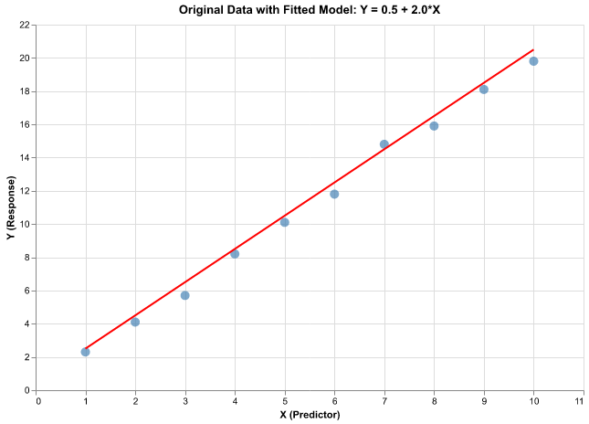
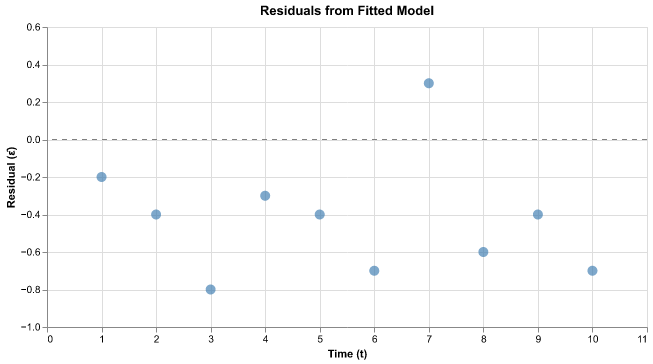
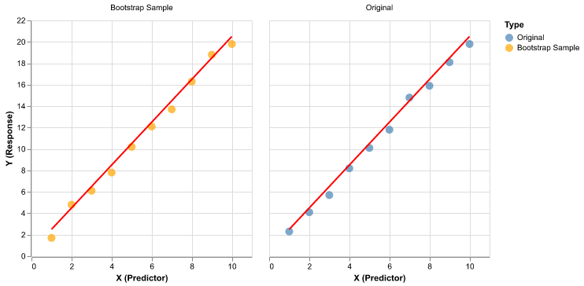
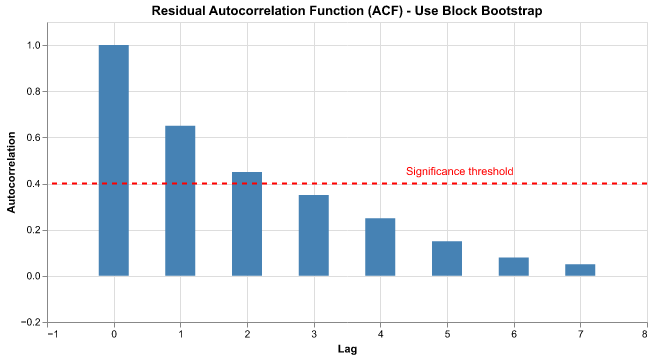
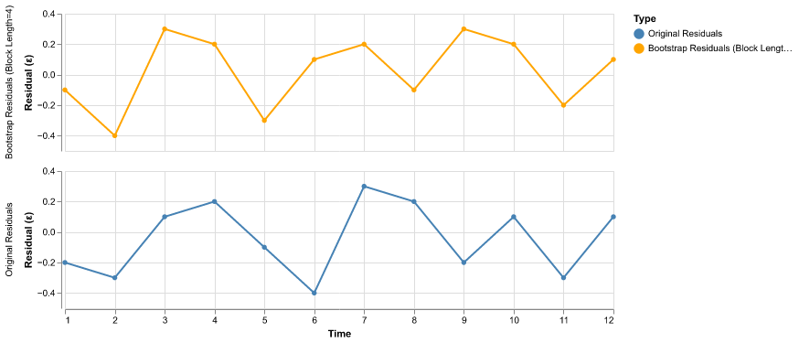
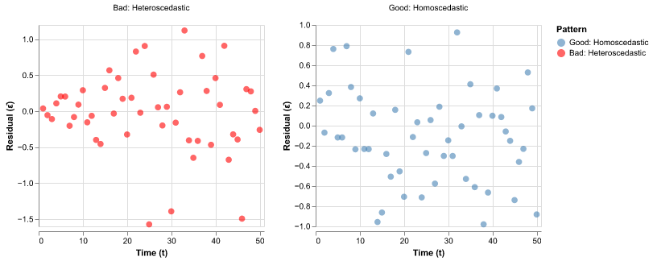
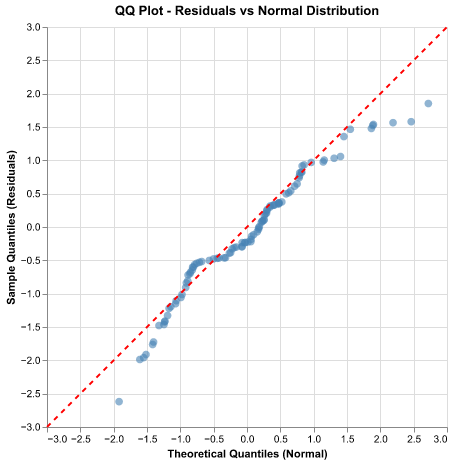
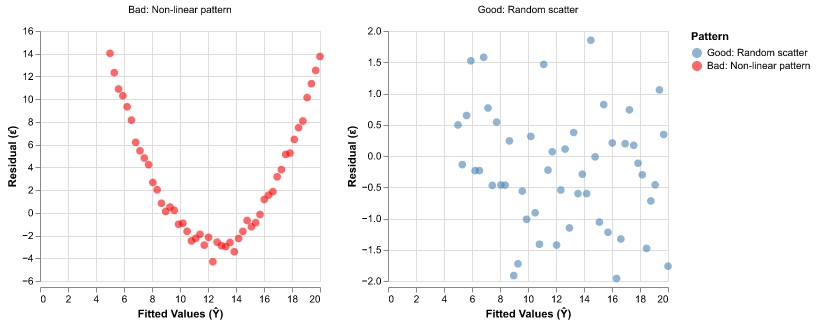
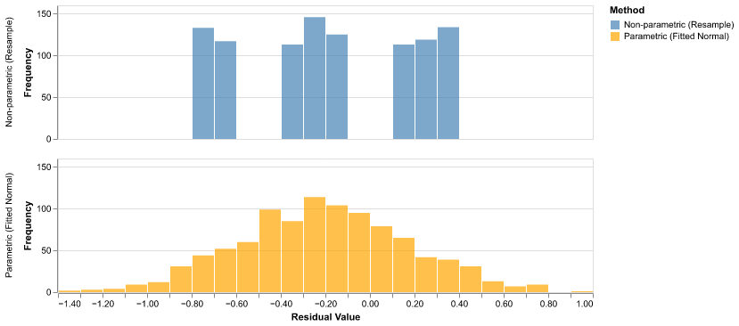
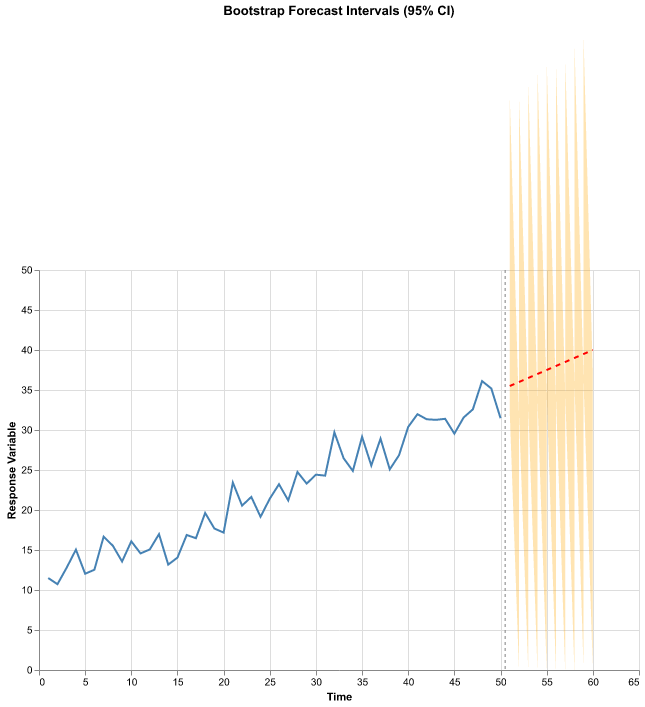

# Residual Bootstrapping for Time Series

This document provides an in-depth explanation of residual bootstrapping techniques for time series models, including
theory, implementation, and practical considerations.

## Table of Contents

1. [Overview](#overview)
2. [Why Residual Bootstrap](#why-residual-bootstrap)
3. [Basic Residual Bootstrap Algorithm](#basic-residual-bootstrap-algorithm)
4. [Sampling from the Predictive Distribution](#sampling-from-the-predictive-distribution)
5. [Block Residual Bootstrap](#block-residual-bootstrap)
6. [Assumptions and Diagnostics](#assumptions-and-diagnostics)
7. [Advanced Techniques](#advanced-techniques)
8. [Implementation Examples](#implementation-examples)
9. [Common Pitfalls](#common-pitfalls)

## Overview

Residual bootstrapping is a resampling technique that separates the deterministic structure of a fitted model from
the random variation in residuals. This approach is particularly powerful for time series because it allows you to:

1. Preserve the fitted relationship between predictors and response
2. Capture uncertainty in model parameters and predictions
3. Account for temporal dependence in residuals
4. Generate realistic forecast intervals

### Key Concept

```
Observed Data = Fitted Model + Residuals
    Y(t)      =    Ŷ(t)     +   ε̂(t)

Bootstrap: Resample residuals, keep fitted model structure
```

## Why Residual Bootstrap

### Problem with Naive Bootstrap

Simply bootstrapping the raw time series Y(t) destroys the relationship between predictors X(t) and response Y(t).

```
Original Data:
X: [1.0, 2.0, 3.0, 4.0, 5.0] (predictor, e.g., time)
Y: [2.1, 4.3, 5.8, 8.2, 9.9] (response, e.g., temperature)

Fitted: Y = 2.0*X + noise

Naive Bootstrap Sample:
X: [1.0, 2.0, 3.0, 4.0, 5.0] (unchanged)
Y: [8.2, 2.1, 9.9, 4.3, 5.8] (randomly reordered)

Result: Destroys X-Y relationship!
X=1.0 now paired with Y=8.2 instead of Y≈2.0
```

### Solution: Bootstrap Residuals

```
1. Fit model: Ŷ(t) = f(X(t), θ̂)
2. Extract residuals: ε̂(t) = Y(t) - Ŷ(t)
3. Resample residuals: ε*(t)
4. Reconstruct: Y*(t) = Ŷ(t) + ε*(t)
5. Refit model to get θ*

Result: Preserves X-Y structure while capturing uncertainty
```

### Visual Comparison



The plot above shows the original data points (blue circles) with the fitted linear model (red line). The fitted
model captures the systematic relationship between X and Y.



The residuals (differences between observed and fitted values) are plotted above. These capture the random variation
around the fitted trend.



The comparison above shows the original data (left) and a bootstrap sample (right). Notice how both preserve the
linear trend (red line), but individual points vary due to resampled residuals. The trend is preserved while
capturing uncertainty.

## Basic Residual Bootstrap Algorithm

### Standard Residual Bootstrap (i.i.d. residuals)

Use when residuals are approximately independent and identically distributed.

```python notest
import numpy as np
from sklearn.linear_model import LinearRegression

def residual_bootstrap(X, y, n_bootstrap=1000):
    """
    Perform residual bootstrap for regression model.

    Parameters:
        X: Predictor array (n_samples, n_features)
        y: Response array (n_samples,)
        n_bootstrap: Number of bootstrap samples

    Returns:
        bootstrap_coefficients: Array of bootstrap parameter estimates
        bootstrap_predictions: Array of bootstrap predictions
    """
    # Step 1: Fit model
    model = LinearRegression()
    model.fit(X, y)
    y_fitted = model.predict(X)

    # Step 2: Compute residuals
    residuals = y - y_fitted

    # Step 3: Center residuals
    residuals_centered = residuals - residuals.mean()

    # Step 4: Bootstrap loop
    bootstrap_coefficients = []
    bootstrap_predictions = []

    for b in range(n_bootstrap):
        # a. Resample residuals with replacement
        residuals_star = np.random.choice(residuals_centered, size=len(y), replace=True)

        # b. Generate bootstrap response
        y_star = y_fitted + residuals_star

        # c. Refit model
        model_star = LinearRegression()
        model_star.fit(X, y_star)

        # d. Store results
        bootstrap_coefficients.append(model_star.coef_)
        bootstrap_predictions.append(model_star.predict(X))

    # Step 5: Calculate bootstrap statistics
    bootstrap_coefficients = np.array(bootstrap_coefficients)
    bootstrap_predictions = np.array(bootstrap_predictions)

    # Calculate 95% confidence intervals
    ci_lower = np.percentile(bootstrap_coefficients, 2.5, axis=0)
    ci_upper = np.percentile(bootstrap_coefficients, 97.5, axis=0)

    return bootstrap_coefficients, bootstrap_predictions, (ci_lower, ci_upper)


# Example usage
X = np.array([[1.0], [2.0], [3.0], [4.0], [5.0], [6.0], [7.0], [8.0], [9.0], [10.0]])
y = np.array([2.3, 4.1, 5.7, 8.2, 10.1, 11.8, 14.2, 15.9, 18.1, 19.8])

bootstrap_coef, bootstrap_pred, ci = residual_bootstrap(X, y, n_bootstrap=1000)

print(f"Original coefficient: {LinearRegression().fit(X, y).coef_[0]:.3f}")
print(f"Bootstrap mean: {bootstrap_coef.mean():.3f}")
print(f"95% CI: [{ci[0][0]:.3f}, {ci[1][0]:.3f}]")
```

## Sampling from the Predictive Distribution

Residual bootstrapping is useful for sampling from the predictive distribution, but there are two distinct approaches
depending on whether you need to account for parameter uncertainty.

### Approach 1: Simple Prediction Intervals (No Refitting)

When you only need prediction intervals for new observations and can treat model parameters as fixed:

```python notest
import numpy as np
from sklearn.linear_model import LinearRegression

def simple_prediction_interval(X_train, y_train, X_new, n_samples=1000, alpha=0.05):
    """
    Generate prediction intervals by resampling residuals without refitting.

    Use case: Fast prediction intervals when parameter uncertainty is negligible
              or when you want to condition on the fitted model.

    Returns: Point predictions and (lower, upper) bounds
    """
    # Fit model once
    model = LinearRegression()
    model.fit(X_train, y_train)

    # Get residuals
    y_fitted = model.predict(X_train)
    residuals = y_train - y_fitted
    residuals_centered = residuals - residuals.mean()

    # Predict at new points
    y_pred = model.predict(X_new)

    # Generate samples from predictive distribution
    n_new = len(X_new)
    y_samples = np.zeros((n_samples, n_new))

    for i in range(n_samples):
        # Resample residuals
        residuals_star = np.random.choice(residuals_centered, size=n_new, replace=True)

        # Y_new = Ŷ_new + ε*  (no refitting)
        y_samples[i, :] = y_pred + residuals_star

    # Calculate prediction intervals
    lower = np.percentile(y_samples, 100 * alpha / 2, axis=0)
    upper = np.percentile(y_samples, 100 * (1 - alpha / 2), axis=0)

    return y_pred, lower, upper, y_samples


# Example
X_train = np.arange(1, 51).reshape(-1, 1)
y_train = 2.0 + 0.5 * X_train.flatten() + np.random.normal(0, 1, 50)
X_new = np.array([[52], [53], [54]])

y_pred, lower, upper, samples = simple_prediction_interval(X_train, y_train, X_new)

print("Simple Prediction Intervals (parameters fixed):")
for i in range(len(X_new)):
    print(f"  X={X_new[i,0]}: {y_pred[i]:.2f} [{lower[i]:.2f}, {upper[i]:.2f}]")
print(f"\nEach interval based on {samples.shape[0]} samples from predictive distribution")
```

**Key characteristics:**
- **Fast**: Model fitted only once
- **Narrower intervals**: Only captures residual uncertainty
- **Assumption**: Treats parameters θ̂ as known/fixed
- **Use when**: Large sample size, parameter estimates are stable, or you want to condition on the fitted model

### Approach 2: Full Predictive Distribution (With Refitting)

When you need to account for both parameter uncertainty and residual uncertainty:

```python notest
def full_predictive_distribution(X_train, y_train, X_new, n_bootstrap=1000, alpha=0.05):
    """
    Generate samples from full predictive distribution by refitting model.

    Use case: When parameter uncertainty is non-negligible or you want
              marginal (not conditional) prediction intervals.

    Returns: (mean prediction, lower, upper, all samples)
    """
    n = len(y_train)
    n_new = len(X_new)

    # Fit original model
    model = LinearRegression()
    model.fit(X_train, y_train)
    y_fitted = model.predict(X_train)
    residuals = y_train - y_fitted
    residuals_centered = residuals - residuals.mean()

    # Store bootstrap predictions
    y_pred_bootstrap = np.zeros((n_bootstrap, n_new))

    for b in range(n_bootstrap):
        # Resample residuals for training data
        residuals_star = np.random.choice(residuals_centered, size=n, replace=True)

        # Create bootstrap training data
        y_train_star = y_fitted + residuals_star

        # Refit model (captures parameter uncertainty)
        model_star = LinearRegression()
        model_star.fit(X_train, y_train_star)

        # Predict with bootstrap parameters
        y_pred_star = model_star.predict(X_new)

        # Add residual uncertainty for predictions
        residuals_new = np.random.choice(residuals_centered, size=n_new, replace=True)
        y_pred_bootstrap[b, :] = y_pred_star + residuals_new

    # Calculate prediction intervals
    y_pred_mean = y_pred_bootstrap.mean(axis=0)
    lower = np.percentile(y_pred_bootstrap, 100 * alpha / 2, axis=0)
    upper = np.percentile(y_pred_bootstrap, 100 * (1 - alpha / 2), axis=0)

    return y_pred_mean, lower, upper, y_pred_bootstrap


# Example
y_pred_full, lower_full, upper_full, samples_full = full_predictive_distribution(
    X_train, y_train, X_new
)

print("\nFull Predictive Distribution (with parameter uncertainty):")
for i in range(len(X_new)):
    print(f"  X={X_new[i,0]}: {y_pred_full[i]:.2f} [{lower_full[i]:.2f}, {upper_full[i]:.2f}]")

print("\nInterval Width Comparison:")
for i in range(len(X_new)):
    width_simple = upper[i] - lower[i]
    width_full = upper_full[i] - lower_full[i]
    print(f"  X={X_new[i,0]}: Simple={width_simple:.2f}, Full={width_full:.2f} "
          f"(+{100*(width_full/width_simple - 1):.1f}%)")
```

**Key characteristics:**
- **Wider intervals**: Captures both parameter and residual uncertainty
- **More realistic**: Acknowledges that we don't know true parameters
- **Computationally expensive**: Requires B model fits
- **Use when**: Small/moderate sample size, parameters uncertain, or you want unconditional predictions

### Comparison: What Each Approach Estimates

```python notest
import numpy as np
import matplotlib.pyplot as plt

# Conceptual illustration
np.random.seed(42)
X_train = np.linspace(0, 10, 50).reshape(-1, 1)
y_train = 2 + 0.5 * X_train.flatten() + np.random.normal(0, 1, 50)
X_new = np.array([[11], [12], [13]])

# Get both types of intervals
y_pred_simple, lower_simple, upper_simple, samples_simple = simple_prediction_interval(
    X_train, y_train, X_new, n_samples=1000
)
y_pred_full, lower_full, upper_full, samples_full = full_predictive_distribution(
    X_train, y_train, X_new, n_bootstrap=1000
)

print("Understanding the difference:")
print("\nSimple approach (no refitting):")
print("  - Samples from: p(Y_new | X_new, θ̂)")
print("  - Interpretation: Distribution of Y_new IF the parameters were exactly θ̂")
print("  - Uncertainty source: Residual variation only")
print(f"  - Example width: {upper_simple[0] - lower_simple[0]:.2f}")

print("\nFull approach (with refitting):")
print("  - Samples from: p(Y_new | X_new, data)")
print("  - Interpretation: Distribution of Y_new accounting for our uncertainty about θ")
print("  - Uncertainty sources: Residual variation + parameter uncertainty")
print(f"  - Example width: {upper_full[0] - lower_full[0]:.2f}")

print("\nParameter uncertainty contribution:")
print(f"  - Additional width: {(upper_full[0] - lower_full[0]) - (upper_simple[0] - lower_simple[0]):.2f}")
print(f"  - Percentage increase: {100 * ((upper_full[0] - lower_full[0]) / (upper_simple[0] - lower_simple[0]) - 1):.1f}%")
```

### When to Use Each Approach

**Use Simple Prediction Intervals (no refitting) when:**
- You have a large training sample (n > 500)
- Parameters are well-estimated (narrow confidence intervals)
- You want computational efficiency
- You explicitly want predictions conditional on the fitted model
- You're doing many predictions and parameter uncertainty is negligible

**Use Full Predictive Distribution (with refitting) when:**
- Training sample is small or moderate (n < 500)
- You want honest uncertainty quantification
- Parameter estimates are uncertain
- You're making predictions far from training data
- This is the more conservative and generally recommended approach

### Connection to Bayesian Methods

The full residual bootstrap approach approximates the Bayesian posterior predictive distribution:

```
Bayesian:    p(Y_new | X_new, data) = ∫ p(Y_new | X_new, θ) p(θ | data) dθ
                                         ↑ likelihood        ↑ posterior

Bootstrap:   Approximates this by:
             - Treating bootstrap parameters θ̂* as samples from p(θ | data)
             - Resampled residuals represent p(Y_new | X_new, θ)
             - Monte Carlo integration over both sources of uncertainty
```

The bootstrap is essentially a computational shortcut that avoids specifying prior distributions while still
capturing parameter uncertainty through resampling.

## Block Residual Bootstrap

For time series with autocorrelated residuals, use block bootstrapping of residuals.

### When to Use

Check residual autocorrelation:



The plot above shows the autocorrelation function (ACF) of residuals. When the ACF exceeds the significance
threshold (red dashed line) at multiple lags, it indicates residuals are autocorrelated. In this case,
use block residual bootstrap to preserve the temporal dependence structure.

### Algorithm: Block Residual Bootstrap

```python notest
import numpy as np
from sklearn.linear_model import LinearRegression

def block_residual_bootstrap(X, y, block_length, n_bootstrap=1000):
    """
    Perform block residual bootstrap for time series regression.

    Parameters:
        X: Predictor array (n_samples, n_features)
        y: Response array (n_samples,)
        block_length: Length of blocks for resampling
        n_bootstrap: Number of bootstrap samples

    Returns:
        bootstrap_coefficients: Array of bootstrap parameter estimates
    """
    # Step 1: Fit model and extract residuals
    model = LinearRegression()
    model.fit(X, y)
    y_fitted = model.predict(X)
    residuals = y - y_fitted

    # Center residuals
    residuals_centered = residuals - residuals.mean()

    n = len(residuals_centered)
    bootstrap_coefficients = []

    # Step 2: Block length is provided (chosen based on ACF)

    for b in range(n_bootstrap):
        # Step 3: Create overlapping blocks
        blocks = []
        for i in range(n - block_length + 1):
            blocks.append(residuals_centered[i:i + block_length])

        # Step 4a: Randomly select blocks and concatenate
        residuals_star = []
        while len(residuals_star) < n:
            # Randomly select a block
            block_index = np.random.randint(0, len(blocks))
            residuals_star.extend(blocks[block_index])

        # Step 4b: Truncate to exactly n residuals
        residuals_star = np.array(residuals_star[:n])

        # Step 4c: Generate bootstrap response
        y_star = y_fitted + residuals_star

        # Step 4d: Refit model
        model_star = LinearRegression()
        model_star.fit(X, y_star)
        bootstrap_coefficients.append(model_star.coef_)

    bootstrap_coefficients = np.array(bootstrap_coefficients)

    # Calculate confidence intervals
    ci_lower = np.percentile(bootstrap_coefficients, 2.5, axis=0)
    ci_upper = np.percentile(bootstrap_coefficients, 97.5, axis=0)

    return bootstrap_coefficients, (ci_lower, ci_upper)


# Example usage with block length of 4
X = np.arange(1, 51).reshape(-1, 1)  # Time points
y = 2.0 + 0.5 * X.flatten() + np.random.normal(0, 1, 50)  # Linear trend with noise

bootstrap_coef, ci = block_residual_bootstrap(X, y, block_length=4, n_bootstrap=1000)

print(f"Bootstrap mean coefficient: {bootstrap_coef.mean():.3f}")
print(f"95% CI: [{ci[0][0]:.3f}, {ci[1][0]:.3f}]")
```

### Illustration: Block Residual Bootstrap



The plot above compares original residuals (top) with bootstrap residuals created using block length of 4 (bottom).
The block bootstrap preserves local temporal patterns by resampling contiguous blocks rather than individual points.
Notice how both series maintain similar short-term correlation structures.

## Assumptions and Diagnostics

### Key Assumptions

1. **Model is correctly specified**: The functional form f(X, θ) captures the true relationship
2. **Residuals are homoscedastic**: Constant variance over time
3. **Residuals are stationary**: Statistical properties don't change over time
4. **Large sample**: n should be reasonably large (n > 50 recommended)

### Diagnostic Checks

**1. Residual Plot (check homoscedasticity)**



The left panel shows good homoscedastic residuals with constant variance over time (random scatter around zero).
The right panel shows heteroscedastic residuals with increasing variance over time, which violates the bootstrap
assumption and requires special treatment (see Heteroscedasticity Correction below).

**2. ACF of Residuals (check independence)**

If significant autocorrelation is present, use block bootstrap (see previous section).

**3. QQ Plot (check normality assumption)**



The QQ plot compares the distribution of residuals (sample quantiles) against a theoretical normal distribution.
Points falling along the diagonal line indicate residuals are approximately normally distributed. Deviations from
the line suggest non-normality, though bootstrap methods are generally robust to moderate departures from normality.

**4. Residuals vs Fitted (check model specification)**



The left panel shows good model specification with random scatter (no pattern). The right panel shows a non-linear
pattern suggesting the model is misspecified (e.g., missing a quadratic term). Patterns in this plot indicate that
the model structure should be improved before applying bootstrap methods.

### Heteroscedasticity Correction

If residuals have non-constant variance:

**Approach 1: Wild Bootstrap**

```python notest
import numpy as np
from sklearn.linear_model import LinearRegression

def wild_bootstrap(X, y, n_bootstrap=1000, weight_type="rademacher"):
    """
    Wild bootstrap for heteroscedastic residuals.

    Parameters:
        X: Predictor array
        y: Response array
        n_bootstrap: Number of bootstrap samples
        weight_type: "rademacher" or "mammen"
    """
    # Fit model
    model = LinearRegression()
    model.fit(X, y)
    y_fitted = model.predict(X)
    residuals = y - y_fitted

    n = len(y)
    bootstrap_coefficients = []

    for b in range(n_bootstrap):
        # Generate random weights
        if weight_type == "rademacher":
            weights = np.random.choice([-1, 1], size=n)
        elif weight_type == "mammen":
            # Mammen distribution
            golden_ratio = (np.sqrt(5) + 1) / 2
            p = (golden_ratio - 1) / (2 * golden_ratio - 1)
            weights = np.random.choice(
                [-(np.sqrt(5) - 1) / 2, (np.sqrt(5) + 1) / 2],
                size=n,
                p=[p, 1 - p]
            )

        # Wild bootstrap: multiply residuals by random weights
        residuals_star = weights * residuals

        # Generate bootstrap response
        y_star = y_fitted + residuals_star

        # Refit model
        model_star = LinearRegression()
        model_star.fit(X, y_star)
        bootstrap_coefficients.append(model_star.coef_)

    return np.array(bootstrap_coefficients)
```

**Approach 2: Residual Transformation**

```python notest
def variance_stabilizing_bootstrap(X, y, n_bootstrap=1000):
    """
    Bootstrap with variance stabilization for heteroscedastic residuals.
    """
    from sklearn.ensemble import RandomForestRegressor

    # Fit model
    model = LinearRegression()
    model.fit(X, y)
    y_fitted = model.predict(X)
    residuals = y - y_fitted

    # Model variance as function of X (using absolute residuals)
    variance_model = RandomForestRegressor(n_estimators=50, random_state=42)
    variance_model.fit(X, np.abs(residuals))
    sigma_hat = variance_model.predict(X)

    # Standardize residuals
    residuals_standardized = residuals / sigma_hat

    bootstrap_coefficients = []

    for b in range(n_bootstrap):
        # Bootstrap standardized residuals
        residuals_star_standardized = np.random.choice(
            residuals_standardized, size=len(y), replace=True
        )

        # Reconstruct with variance structure
        residuals_star = residuals_star_standardized * sigma_hat

        # Generate bootstrap response
        y_star = y_fitted + residuals_star

        # Refit model
        model_star = LinearRegression()
        model_star.fit(X, y_star)
        bootstrap_coefficients.append(model_star.coef_)

    return np.array(bootstrap_coefficients)
```

## Advanced Techniques

### Parametric Residual Bootstrap

Instead of resampling residuals, draw from a fitted distribution.

```python notest
import numpy as np
from sklearn.linear_model import LinearRegression
from scipy import stats

def parametric_residual_bootstrap(X, y, n_bootstrap=1000):
    """
    Parametric bootstrap assuming normally distributed residuals.

    Parameters:
        X: Predictor array
        y: Response array
        n_bootstrap: Number of bootstrap samples

    Returns:
        bootstrap_coefficients: Array of bootstrap estimates
    """
    # Step 1: Fit model and extract residuals
    model = LinearRegression()
    model.fit(X, y)
    y_fitted = model.predict(X)
    residuals = y - y_fitted

    # Step 2: Fit distribution to residuals (assuming normal)
    mu_hat = 0  # Residuals should have mean zero
    sigma_hat = np.std(residuals, ddof=1)

    n = len(y)
    bootstrap_coefficients = []

    # Step 3: Bootstrap loop
    for b in range(n_bootstrap):
        # a. Draw from fitted normal distribution
        residuals_star = np.random.normal(mu_hat, sigma_hat, size=n)

        # b. Generate bootstrap response
        y_star = y_fitted + residuals_star

        # c. Refit model
        model_star = LinearRegression()
        model_star.fit(X, y_star)
        bootstrap_coefficients.append(model_star.coef_)

    return np.array(bootstrap_coefficients)


# Alternative: Using kernel density estimation (non-parametric density)
def kde_residual_bootstrap(X, y, n_bootstrap=1000):
    """
    Bootstrap using kernel density estimation of residuals.
    """
    from scipy.stats import gaussian_kde

    # Fit model
    model = LinearRegression()
    model.fit(X, y)
    y_fitted = model.predict(X)
    residuals = y - y_fitted

    # Fit kernel density to residuals
    kde = gaussian_kde(residuals)

    n = len(y)
    bootstrap_coefficients = []

    for b in range(n_bootstrap):
        # Draw from kernel density estimate
        residuals_star = kde.resample(n).flatten()

        # Generate bootstrap response
        y_star = y_fitted + residuals_star

        # Refit model
        model_star = LinearRegression()
        model_star.fit(X, y_star)
        bootstrap_coefficients.append(model_star.coef_)

    return np.array(bootstrap_coefficients)
```

### Comparison: Parametric vs Non-parametric



The top panel shows non-parametric bootstrap distribution (resampling actual residuals), which preserves the exact
empirical distribution including any irregularities. The bottom panel shows parametric bootstrap distribution
(drawing from fitted normal distribution), which produces a smoother distribution and can generate values outside
the observed range. Parametric bootstrap assumes a distributional form, while non-parametric makes no such assumption.

### Sieve Bootstrap

For complex time series models (ARMA, GARCH, etc.):

```python notest
import numpy as np
from sklearn.linear_model import LinearRegression
from statsmodels.tsa.ar_model import AutoReg

def sieve_bootstrap(X, y, n_bootstrap=1000, ar_order=None):
    """
    Sieve bootstrap for complex residual dependence.

    Parameters:
        X: Predictor array
        y: Response array
        n_bootstrap: Number of bootstrap samples
        ar_order: AR order (None for automatic selection)

    Returns:
        bootstrap_coefficients: Array of bootstrap estimates
    """
    # Step 1: Fit main regression model
    model = LinearRegression()
    model.fit(X, y)
    y_fitted = model.predict(X)
    residuals = y - y_fitted

    # Fit AR model to residuals (automatic order selection if not specified)
    if ar_order is None:
        # Use AIC to select order
        best_aic = np.inf
        best_order = 1
        for p in range(1, min(11, len(residuals) // 10)):
            try:
                ar_model = AutoReg(residuals, lags=p, old_names=False)
                ar_result = ar_model.fit()
                if ar_result.aic < best_aic:
                    best_aic = ar_result.aic
                    best_order = p
            except:
                continue
        ar_order = best_order

    # Fit AR model with selected order
    ar_model = AutoReg(residuals, lags=ar_order, old_names=False)
    ar_result = ar_model.fit()

    # Step 2: Extract innovations
    innovations = ar_result.resid[ar_order:]  # Remove first p observations

    n = len(y)
    bootstrap_coefficients = []

    for b in range(n_bootstrap):
        # Step 3: Bootstrap innovations
        innovations_star = np.random.choice(innovations, size=n, replace=True)

        # Step 4: Generate bootstrap residuals using fitted AR
        residuals_star = np.zeros(n)
        residuals_star[:ar_order] = residuals[:ar_order]  # Use original for initialization

        for t in range(ar_order, n):
            # AR prediction
            ar_prediction = sum(
                ar_result.params[i] * residuals_star[t - i]
                for i in range(1, ar_order + 1)
            )
            residuals_star[t] = ar_prediction + innovations_star[t]

        # Step 5: Reconstruct response
        y_star = y_fitted + residuals_star

        # Refit main model
        model_star = LinearRegression()
        model_star.fit(X, y_star)
        bootstrap_coefficients.append(model_star.coef_)

    return np.array(bootstrap_coefficients)


# Example usage
# X = np.arange(1, 101).reshape(-1, 1)
# y = 2.0 + 0.5 * X.flatten() + np.random.normal(0, 1, 100)
# bootstrap_coef = sieve_bootstrap(X, y, n_bootstrap=1000)
```

## Implementation Examples

### Example 1: Linear Trend Model

```python notest
import numpy as np
import pandas as pd
from sklearn.linear_model import LinearRegression
import matplotlib.pyplot as plt

# Context: Temperature trend over 50 years
np.random.seed(42)

# Generate synthetic temperature data with trend
years = np.arange(1974, 2024)
X = years.reshape(-1, 1)

# True model: Temperature = 15.2 + 0.03 * Year + noise
true_intercept = 15.2
true_slope = 0.03
temperature = true_intercept + true_slope * years + np.random.normal(0, 0.5, 50)

# Step 1: Fit OLS
model = LinearRegression()
model.fit(X, temperature)
temp_fitted = model.predict(X)

print(f"Fitted model: Temperature = {model.intercept_:.2f} + {model.coef_[0]:.4f} * Year")
print(f"Interpretation: {model.coef_[0]:.4f}°C increase per year")

# Step 2: Extract residuals
residuals = temperature - temp_fitted

# Step 3: Check ACF (assuming significant autocorrelation up to lag 3)
# Use block length ℓ = 5

# Step 4: Generate bootstrap samples using block bootstrap
block_length = 5
n_bootstrap = 5000

bootstrap_slopes = []

for b in range(n_bootstrap):
    # Block bootstrap residuals
    n = len(residuals)
    blocks = [residuals[i:i + block_length] for i in range(n - block_length + 1)]

    residuals_star = []
    while len(residuals_star) < n:
        block_idx = np.random.randint(0, len(blocks))
        residuals_star.extend(blocks[block_idx])
    residuals_star = np.array(residuals_star[:n])

    # Reconstruct temperature
    temp_star = temp_fitted + residuals_star

    # Refit model
    model_star = LinearRegression()
    model_star.fit(X, temp_star)
    bootstrap_slopes.append(model_star.coef_[0])

bootstrap_slopes = np.array(bootstrap_slopes)

# Step 5: Results
ci_lower = np.percentile(bootstrap_slopes, 2.5)
ci_upper = np.percentile(bootstrap_slopes, 97.5)

print(f"\nBootstrap Results:")
print(f"Estimated slope: {model.coef_[0]:.4f}°C/year")
print(f"95% CI: [{ci_lower:.4f}, {ci_upper:.4f}]")
print(f"Conclusion: Significant warming trend confirmed (CI does not include zero)")
```

### Example 2: Seasonal Model with External Predictor

```python notest
import numpy as np
import pandas as pd
from sklearn.linear_model import LinearRegression

# Context: Monthly electricity demand vs temperature
np.random.seed(42)

# Generate 3 years of monthly data
n_months = 36
months = np.arange(1, n_months + 1)
temperature = 15 + 10 * np.sin(2 * np.pi * months / 12) + np.random.normal(0, 2, n_months)

# Create month dummy variables (0-11 for 12 months)
month_of_year = (months - 1) % 12

# True demand model with temperature and seasonal effects
demand = 100 + 2 * temperature + 5 * np.sin(2 * np.pi * months / 12) + np.random.normal(0, 3, n_months)

# Step 1: Fit model with temperature and monthly dummies
df = pd.DataFrame({
    "demand": demand,
    "temperature": temperature,
    "month": month_of_year
})

# Create dummy variables for months
month_dummies = pd.get_dummies(df["month"], prefix="month", drop_first=True)
X = pd.concat([df[["temperature"]], month_dummies], axis=1)
y = df["demand"]

model = LinearRegression()
model.fit(X, y)
demand_fitted = model.predict(X)
residuals = y - demand_fitted

print(f"Temperature coefficient: {model.coef_[0]:.3f}")

# Step 2: Check residuals (assuming mild autocorrelation at lag 1)
block_length = 3

# Step 3: Block residual bootstrap for prediction intervals
def predict_with_interval(X_new, model, residuals, block_length, n_bootstrap=1000):
    """Generate prediction intervals using block bootstrap."""
    y_fitted_new = model.predict(X_new)
    n = len(residuals)

    predictions = []
    for b in range(n_bootstrap):
        # Block bootstrap residuals
        blocks = [residuals.values[i:i + block_length]
                  for i in range(n - block_length + 1)]
        residuals_star = []
        while len(residuals_star) < len(X_new):
            block_idx = np.random.randint(0, len(blocks))
            residuals_star.extend(blocks[block_idx])
        residuals_star = np.array(residuals_star[:len(X_new)])

        # Add to fitted values
        y_new_star = y_fitted_new + residuals_star
        predictions.append(y_new_star)

    predictions = np.array(predictions)
    pi_lower = np.percentile(predictions, 2.5, axis=0)
    pi_upper = np.percentile(predictions, 97.5, axis=0)

    return y_fitted_new, pi_lower, pi_upper


# Example: Predict for next 12 months
future_temps = 15 + 10 * np.sin(2 * np.pi * np.arange(37, 49) / 12)
future_months = np.arange(37, 49) % 12
future_df = pd.DataFrame({"temperature": future_temps, "month": future_months})
future_dummies = pd.get_dummies(future_df["month"], prefix="month", drop_first=True)

# Ensure all month columns are present
for col in month_dummies.columns:
    if col not in future_dummies.columns:
        future_dummies[col] = 0

X_new = pd.concat([future_df[["temperature"]], future_dummies[month_dummies.columns]], axis=1)

y_pred, pi_lower, pi_upper = predict_with_interval(X_new, model, residuals, block_length)

print(f"\nFirst month prediction:")
print(f"  Point estimate: {y_pred.values[0]:.2f}")
print(f"  95% PI: [{pi_lower[0]:.2f}, {pi_upper[0]:.2f}]")
```

### Example 3: Forecast Intervals

```python notest
import numpy as np
from statsmodels.tsa.ar_model import AutoReg

# Setup: AR(1) model for stock returns
np.random.seed(42)

# Generate AR(1) process: Y(t) = 0.1 + 0.7*Y(t-1) + ε(t)
n = 100
alpha_true = 0.1
phi_true = 0.7

y = np.zeros(n)
y[0] = alpha_true / (1 - phi_true)  # Start at mean

for t in range(1, n):
    y[t] = alpha_true + phi_true * y[t-1] + np.random.normal(0, 1)

# Step 1: Fit AR(1) model
ar_model = AutoReg(y, lags=1, old_names=False)
ar_result = ar_model.fit()

alpha_hat = ar_result.params[0]
phi_hat = ar_result.params[1]
residuals = ar_result.resid[1:]  # First observation has no residual

print(f"Fitted AR(1) model:")
print(f"  α̂ = {alpha_hat:.3f}")
print(f"  φ̂ = {phi_hat:.3f}")

# Goal: h-step ahead forecast with uncertainty
h = 10  # Forecast 10 steps ahead
n_bootstrap = 1000

# Step 2-3: Bootstrap loop
forecasts_all_horizons = np.zeros((n_bootstrap, h))

for b in range(n_bootstrap):
    # a. Bootstrap residuals (use block bootstrap for temporal dependence)
    block_length = 3
    blocks = [residuals[i:i + block_length] for i in range(len(residuals) - block_length + 1)]

    residuals_star = []
    while len(residuals_star) < n:
        block_idx = np.random.randint(0, len(blocks))
        residuals_star.extend(blocks[block_idx])
    residuals_star = np.array(residuals_star[:n])

    # b. Generate bootstrap time series
    y_star = np.zeros(n)
    y_star[0] = y[0]
    for t in range(1, n):
        y_star[t] = alpha_hat + phi_hat * y_star[t-1] + residuals_star[t]

    # c. Refit model
    ar_model_star = AutoReg(y_star, lags=1, old_names=False)
    ar_result_star = ar_model_star.fit()
    alpha_star = ar_result_star.params[0]
    phi_star = ar_result_star.params[1]

    # d. Generate h-step forecast
    y_forecast = np.zeros(h)
    y_forecast[0] = alpha_star + phi_star * y[-1]  # One step ahead

    for j in range(1, h):
        y_forecast[j] = alpha_star + phi_star * y_forecast[j-1]

    forecasts_all_horizons[b, :] = y_forecast

# Step 4: Calculate forecast intervals
forecast_mean = forecasts_all_horizons.mean(axis=0)
forecast_lower = np.percentile(forecasts_all_horizons, 2.5, axis=0)
forecast_upper = np.percentile(forecasts_all_horizons, 97.5, axis=0)

print(f"\nForecasts with 95% intervals:")
for j in range(h):
    print(f"  Step {j+1}: {forecast_mean[j]:.3f} [{forecast_lower[j]:.3f}, {forecast_upper[j]:.3f}]")

print(f"\nNote: Interval width increases with forecast horizon")
print(f"  1-step width: {forecast_upper[0] - forecast_lower[0]:.3f}")
print(f"  {h}-step width: {forecast_upper[-1] - forecast_lower[-1]:.3f}")
```



The plot shows historical data (blue line), forecast (red dashed line), and 95% bootstrap prediction interval
(orange shaded region). The prediction interval quantifies uncertainty in future forecasts and naturally widens
as the forecast horizon increases. The vertical line marks the transition from observed to forecast period.

## Common Pitfalls

### 1. Not Centering Residuals

```python notest
import numpy as np

# Problem: Residuals with non-zero mean introduce bias
residuals = np.array([-0.7, -0.5, -0.3, -0.4, -0.6, -0.5, -0.4])
print(f"Mean of residuals: {residuals.mean():.3f}")  # -0.5

# WRONG: Bootstrap without centering
residuals_star_wrong = np.random.choice(residuals, size=len(residuals), replace=True)
# Expected bias: E[ε*] = -0.5, so Y* = Ŷ - 0.5 (biased downward)

# CORRECT: Center residuals before bootstrapping
residuals_centered = residuals - residuals.mean()
print(f"Mean of centered residuals: {residuals_centered.mean():.3e}")  # ~0

residuals_star_correct = np.random.choice(residuals_centered, size=len(residuals), replace=True)
# Now E[ε*] ≈ 0, no bias in Y*
```

### 2. Ignoring Residual Autocorrelation

```
Impact on CI Width:

True (with autocorrelation):
━━━━━━━━━━━━━━━ (wide CI)

Bootstrap ignoring autocorrelation:
━━━━━ (too narrow)

Result: Underestimated uncertainty, coverage < 95%
```

### 3. Wrong Block Length

```
Block too small (ℓ=2 when should be ℓ=10):
    Breaks dependence → CIs too narrow

Block too large (ℓ=n/3):
    Not enough diversity → CIs too wide or unstable

Recommendation:
    - Plot ACF
    - Try multiple block lengths
    - Use data-driven selection (e.g., cross-validation)
```

### 4. Refitting Wrong Model

```
Correct:
    Refit same model structure to bootstrap data

Wrong:
    Changing model complexity based on bootstrap sample
    (introduces additional variability not accounted for)
```

### 5. Using Bootstrap for Model Selection

```
Don't do this:
    1. Fit multiple models
    2. Bootstrap each
    3. Select based on bootstrap performance

Problem: Bootstrap approximates sampling distribution
        under the assumption that the model is correct

For model selection: use cross-validation instead
```

## Summary: Decision Tree

```
Need uncertainty quantification for time series model?
│
├─ Model fitted to data? YES
│  │
│  ├─ Residuals i.i.d.? YES → Standard residual bootstrap
│  │
│  └─ Residuals i.i.d.? NO
│     │
│     ├─ Autocorrelated? YES → Block residual bootstrap
│     │
│     ├─ Heteroscedastic? YES → Wild bootstrap
│     │
│     └─ Complex dependence? YES → Sieve bootstrap
│
└─ Model fitted? NO → Use block bootstrap on raw data
   (see bootstrapping-for-time-series.md)
```

## References

- Freedman, D.A. (1981). Bootstrapping regression models.
- Künsch, H.R. (1989). The jackknife and the bootstrap for general stationary observations.
- Bühlmann, P. (1997). Sieve bootstrap for time series.
- Davison, A.C. & Hinkley, D.V. (1997). Bootstrap Methods and Their Application.
- Kreiss, J.P. & Lahiri, S.N. (2012). Bootstrap methods for time series.

## Application to Climate Models

For chapkit climate prediction models:

1. **Residual bootstrap is ideal** when you have:
   - Fitted climate model with external predictors (e.g., SST, atmospheric indices)
   - Need to assess prediction uncertainty
   - Want to preserve predictor-response relationships

2. **Block residual bootstrap** for:
   - Monthly climate data with seasonal correlation
   - Forecast intervals that account for residual persistence
   - Block length = 12 months (annual cycle) or based on residual ACF

3. **Validation workflow**:
   - Fit model on training data
   - Generate bootstrap samples of residuals
   - Create forecast intervals for test period
   - Compare actual vs predicted with uncertainty bands

4. **Parameter stability assessment**:
   - Generate B bootstrap estimates of model parameters
   - Check if parameters vary substantially across bootstraps
   - Large variation indicates model instability or overfitting
