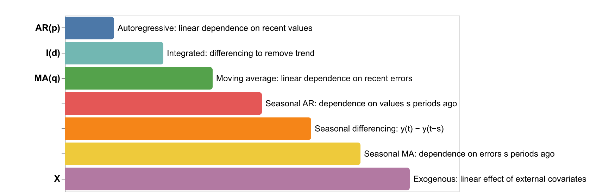
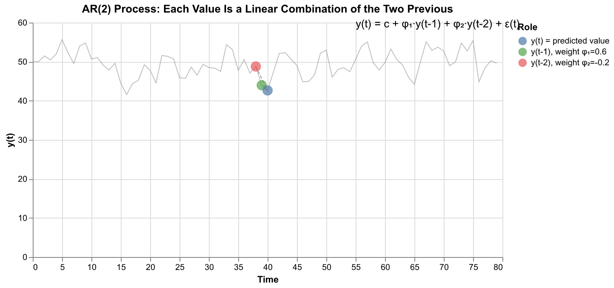
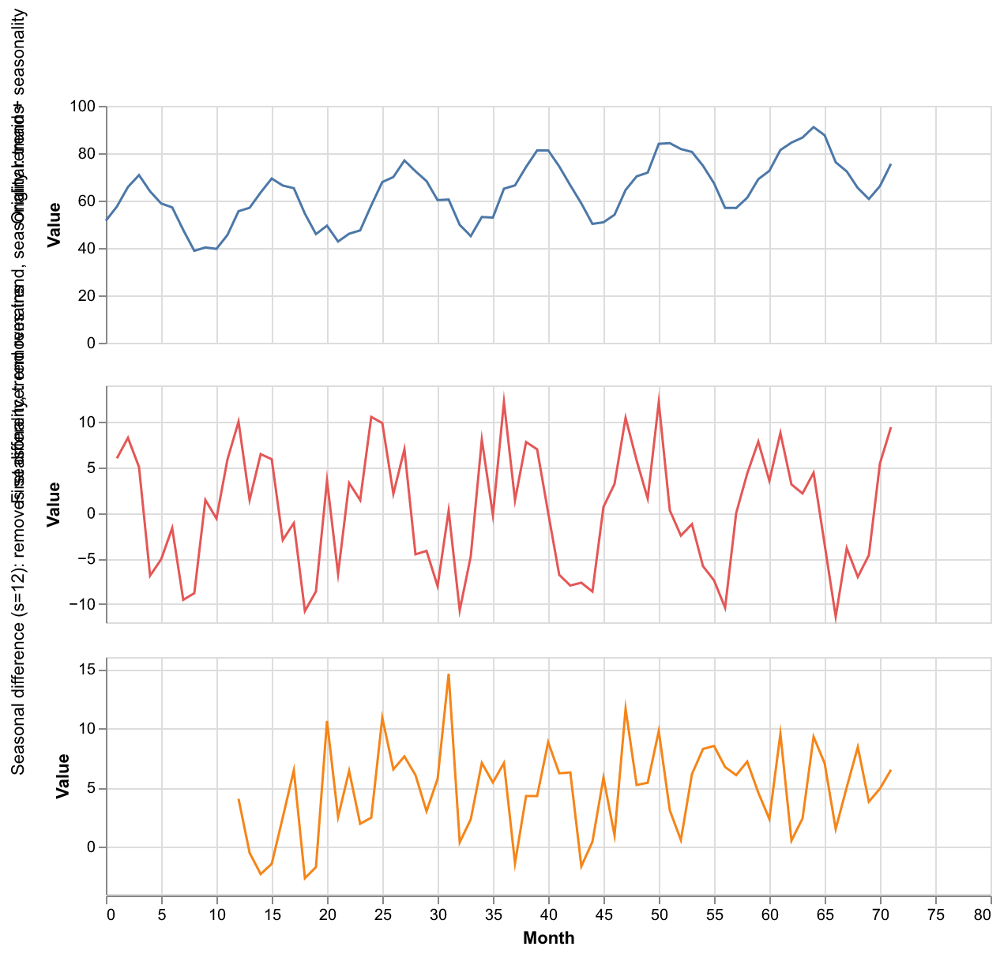
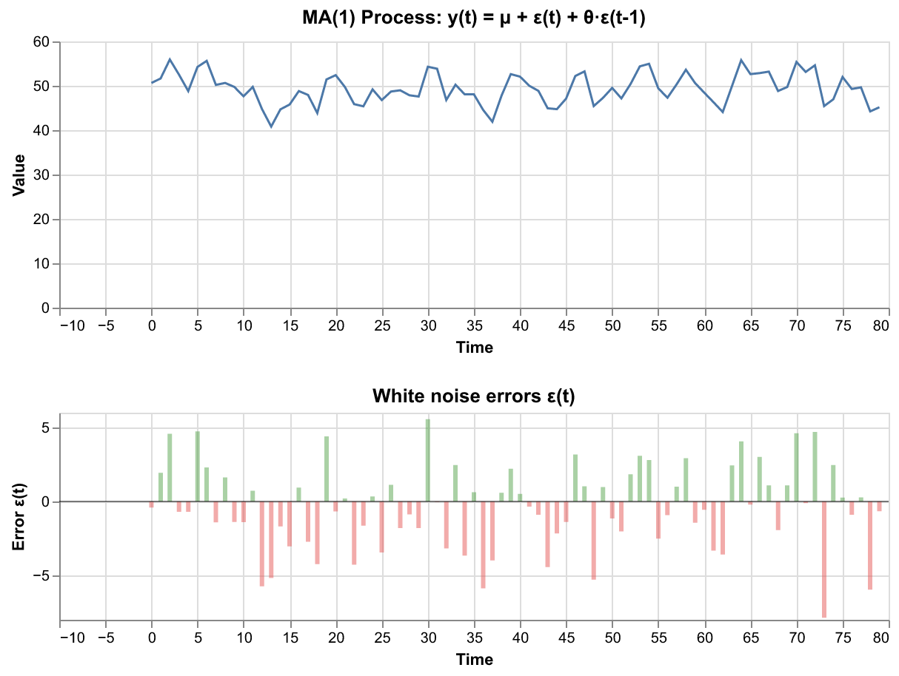
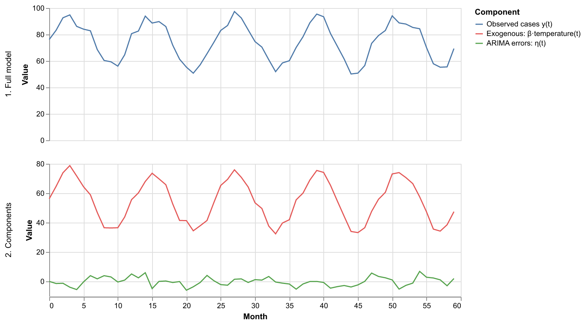
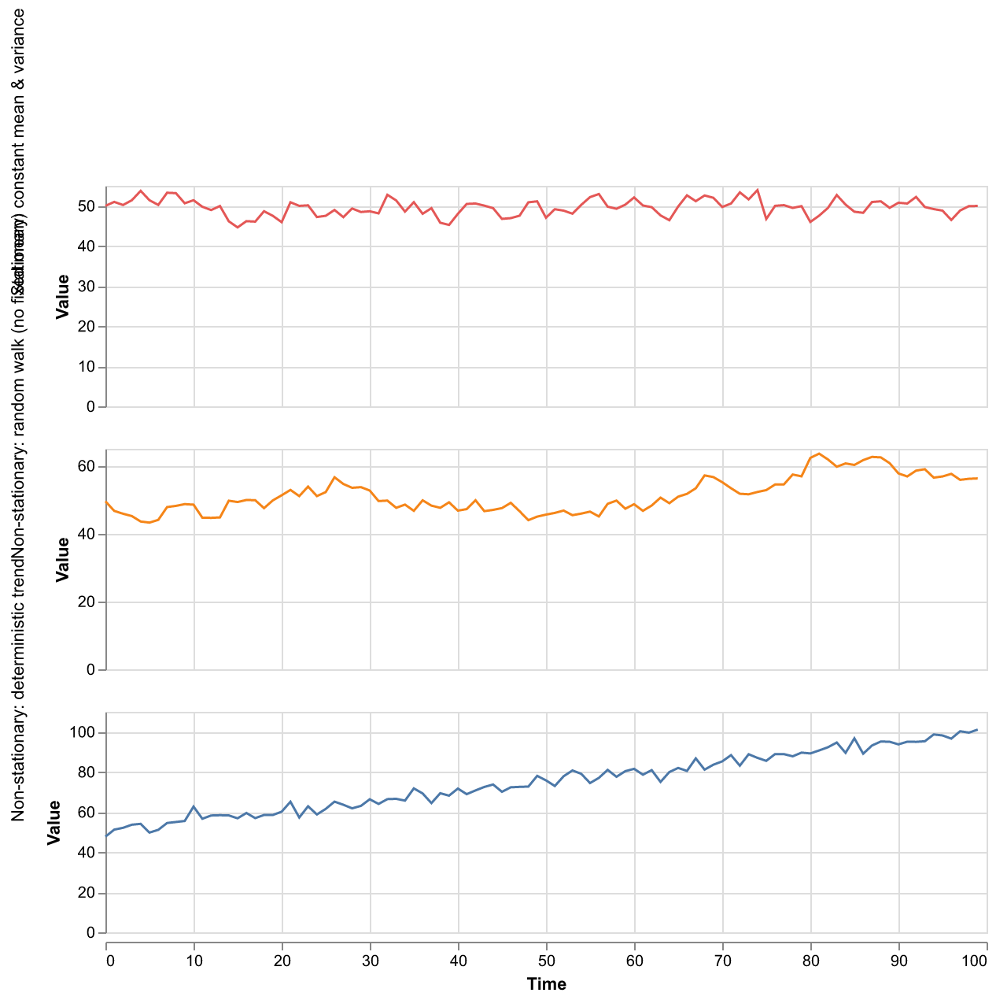
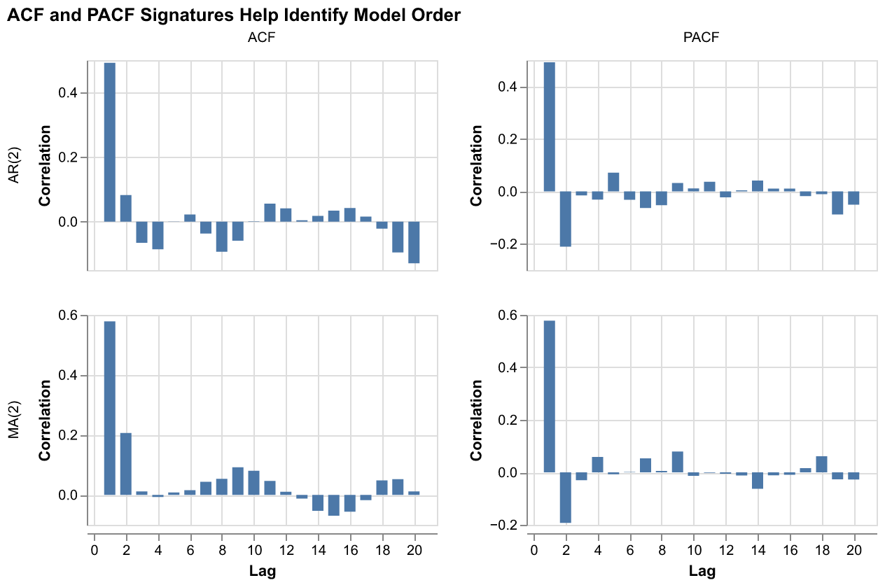
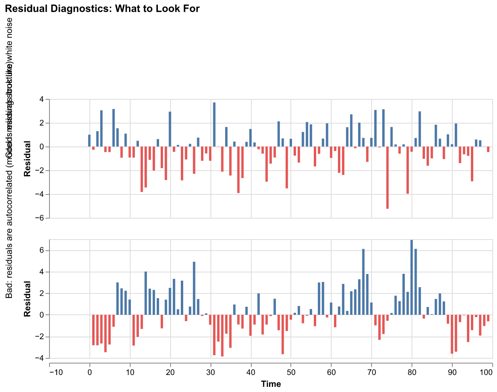
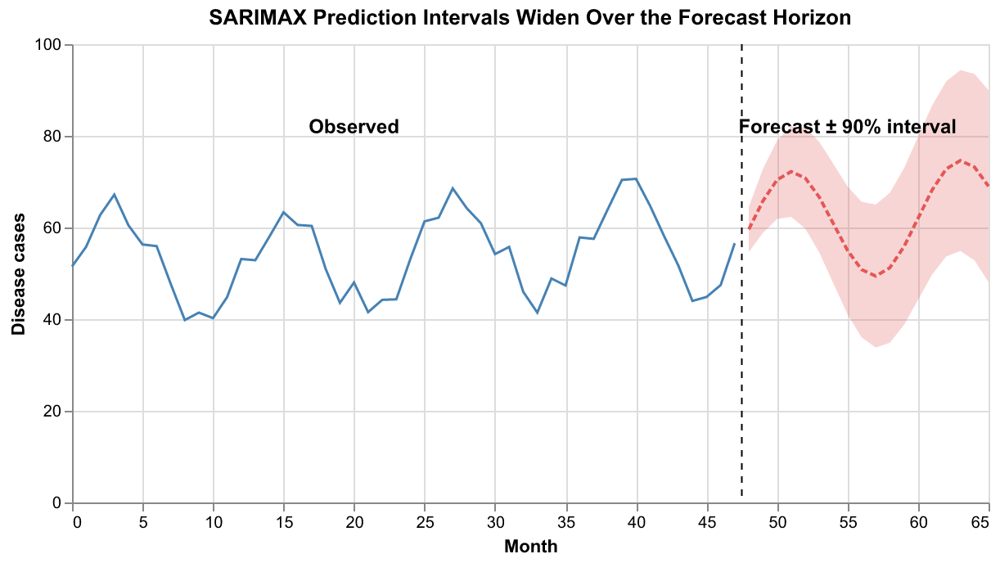
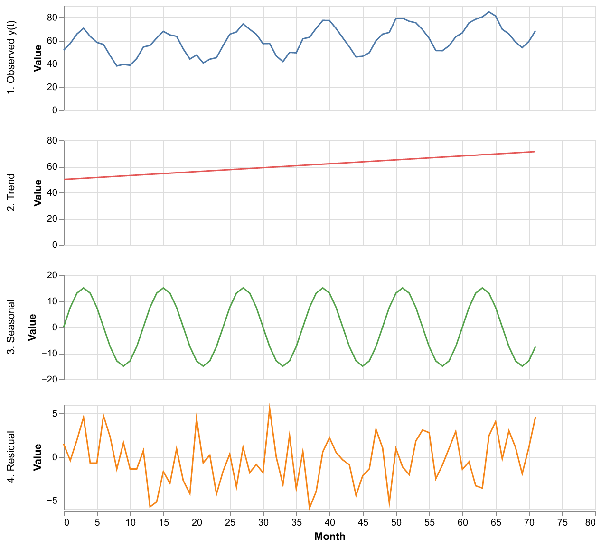

# A Practical Guide to SARIMAX

SARIMAX is one of the most widely used families of time series models. The acronym packs a lot in — **S**easonal **A**uto**R**egressive **I**ntegrated **M**oving **A**verage with e**X**ogenous variables — but each piece has a clear purpose. This guide walks through each component, the assumptions the model makes, and what matters for it to work well in practice.



The full model is written as **SARIMAX(p,d,q)(P,D,Q)ₛ**, where:
- `p, d, q` control the non-seasonal behavior
- `P, D, Q` control the seasonal behavior
- `s` is the seasonal period (e.g. 12 for monthly data with yearly cycles)

We'll build this up one piece at a time.

---

## 1. AR — Autoregressive (the "AR" in ARIMA)

The autoregressive component predicts the current value as a **linear combination of previous values**:

```
y(t) = c + φ₁·y(t-1) + φ₂·y(t-2) + ... + φₚ·y(t-p) + ε(t)
```

- `p` is the **order** — how many past values are used
- `φ₁, φ₂, ..., φₚ` are the **AR coefficients**, estimated from data
- `ε(t)` is a white noise error term (random, unpredictable shock)
- `c` is a constant (intercept)



In this AR(2) example, each value depends on the two immediately preceding values with weights φ₁=0.6 and φ₂=−0.2. The negative second coefficient means that if the series was high two steps ago, it tends to pull back down — creating a slight oscillatory pattern.

**Key intuition:** The AR component captures *momentum* and *mean reversion*. A positive φ₁ close to 1 means "tomorrow will be similar to today" (persistence). A negative φ₂ adds oscillation.

**Stationarity constraint:** The AR coefficients must satisfy conditions that prevent the series from exploding to infinity. For AR(1), this simply requires |φ₁| < 1. For higher orders, the roots of the characteristic polynomial must lie inside the unit circle. In practice, fitting software enforces this automatically.

---

## 2. I — Integrated (Differencing)

Many real-world series have trends or other non-stationary features that violate the assumptions of the AR and MA components. The "I" component addresses this by **differencing** the series before modeling:

```
Δy(t) = y(t) − y(t-1)          ← first difference (d=1)
Δ²y(t) = Δy(t) − Δy(t-1)      ← second difference (d=2)
```

- `d` is the **differencing order** — how many times the series is differenced
- `d=1` removes a linear trend
- `d=2` removes a quadratic trend (rarely needed)
- `d=0` means no differencing (series is already stationary)



The top panel shows the original series with both a trend and seasonality. The middle panel shows the first difference — the trend is gone, but the seasonal oscillation remains (now fluctuating around zero). The bottom panel shows the seasonal difference (discussed in Section 5) which removes the seasonality but leaves the trend.

**Why not just detrend?** Differencing is more general than subtracting a fitted trend line. It handles *stochastic* trends (random walks) that don't follow a fixed functional form. A random walk `y(t) = y(t-1) + ε(t)` has no fixed trend to subtract, but first differencing converts it to white noise `Δy(t) = ε(t)`.

**How to choose d:** In practice, `d=0` or `d=1` covers almost all cases. The Augmented Dickey-Fuller (ADF) test or the KPSS test can help decide: if the test says the series is non-stationary, try `d=1`. If `d=1` still isn't stationary, try `d=2`. Using `d ≥ 2` is rare and often a sign that something else is wrong.

---

## 3. MA — Moving Average

The MA component is the most conceptually tricky part of ARIMA. It models the current value as a linear combination of **past forecast errors** (not past values):

```
y(t) = μ + ε(t) + θ₁·ε(t-1) + θ₂·ε(t-2) + ... + θ_q·ε(t-q)
```

- `q` is the **order** — how many past errors are used
- `θ₁, θ₂, ..., θ_q` are the **MA coefficients**
- `ε(t), ε(t-1), ...` are the white noise shocks (innovations)



The top panel shows an MA(1) process. The bottom panel shows the underlying white noise errors. Notice how the MA process is "smoother" than the raw noise — the θ·ε(t-1) term carries forward part of yesterday's shock, creating short-term correlations.

**Key intuition:** The MA component captures *short-lived shocks* that affect the series for a few time steps and then dissipate. If a drought causes a spike in cases this month, the MA term can model how that shock echoes into next month's count before fading away.

**The name is misleading:** Despite being called "moving average", the MA component is *not* a rolling window average of past values. It's a weighted sum of past *errors*. The name comes from the mathematical equivalence between the MA representation and a certain infinite-order weighted average of past values.

**Invertibility:** Just as AR coefficients must satisfy stationarity constraints, MA coefficients must satisfy *invertibility* constraints (the roots of the MA polynomial lie inside the unit circle). This ensures the model has a unique representation. Fitting software handles this automatically.

---

## 4. Putting AR, I, and MA Together: ARIMA(p,d,q)

The three components combine as follows:

1. **Difference** the series `d` times to make it stationary
2. Model the differenced series with **AR(p)** and **MA(q)** terms

Written mathematically for ARIMA(p,d,q):

```
φ(B) · Δᵈy(t) = c + θ(B) · ε(t)
```

where:
- `B` is the **backshift operator**: `B·y(t) = y(t-1)`, `B²·y(t) = y(t-2)`, etc.
- `φ(B) = 1 − φ₁B − φ₂B² − ... − φₚBᵖ` is the AR polynomial
- `θ(B) = 1 + θ₁B + θ₂B² + ... + θ_qBq` is the MA polynomial
- `Δᵈ = (1-B)ᵈ` is the differencing operator

Don't worry if the backshift notation looks abstract — it's just a compact way to write "apply AR to the differenced series, with MA errors."

### Common special cases

| Model | Description | When to use |
|-------|-------------|-------------|
| ARIMA(0,0,0) | White noise | Random data with no structure |
| ARIMA(1,0,0) | AR(1) | Series with simple persistence |
| ARIMA(0,1,0) | Random walk | Non-stationary series with no predictable dynamics |
| ARIMA(0,1,1) | Simple exponential smoothing (equivalent) | Non-stationary with short-memory shocks |
| ARIMA(1,1,1) | Workhorse model | Differenced series with both persistence and shock effects |

---

## 5. Seasonal Extension: SARIMA(p,d,q)(P,D,Q)ₛ

Many time series — especially disease data — have a strong seasonal cycle. SARIMA adds a second set of AR, I, and MA components that operate at the **seasonal lag** `s`:

```
Φ(Bˢ) · φ(B) · Δˢᴰ · Δᵈ · y(t) = c + Θ(Bˢ) · θ(B) · ε(t)
```

where:
- `Φ(Bˢ) = 1 − Φ₁Bˢ − Φ₂B²ˢ − ... − ΦₚBᴾˢ` — seasonal AR polynomial
- `Θ(Bˢ) = 1 + Θ₁Bˢ + Θ₂B²ˢ + ... + Θ_QBQˢ` — seasonal MA polynomial
- `Δˢ = (1 − Bˢ)` — seasonal differencing: `y(t) − y(t-s)`
- `s` — seasonal period (12 for monthly, 52 for weekly, etc.)

### What does each seasonal component do?

**Seasonal AR (P):** This month's value depends on the value from the **same month last year** (and possibly 2 years ago, etc.):

```
Seasonal AR(1)₁₂:  y depends on y(t-12)
```

If January tends to be high and the previous January was also high, the seasonal AR captures this.

**Seasonal differencing (D):** Instead of subtracting the previous value, subtract the value from **one full season ago**:

```
Δ₁₂y(t) = y(t) − y(t-12)
```

This removes a repeating seasonal pattern. After seasonal differencing, each value represents how this month differs from the same month last year.

**Seasonal MA (Q):** The forecast error from the same month last year influences this month:

```
Seasonal MA(1)₁₂:  ε(t-12) influences y(t)
```

If the model under-predicted last January, the seasonal MA corrects for a similar miss this January.

### Common seasonal specifications

For monthly disease data with yearly seasonality (`s=12`):

| Specification | Meaning |
|--------------|---------|
| (1,1,1)(1,1,1)₁₂ | Full seasonal model — the standard starting point |
| (1,1,1)(0,1,1)₁₂ | Seasonal MA only (no seasonal AR) — often sufficient |
| (1,0,0)(1,0,0)₁₂ | No differencing, AR at both levels — for stationary seasonal data |

---

## 6. Exogenous Variables: The X in SARIMAX

SARIMAX allows **external covariates** (temperature, rainfall, population, etc.) to enter the model as a linear regression:

```
y(t) = β₁·x₁(t) + β₂·x₂(t) + ... + η(t)

where η(t) follows a SARIMA process
```



The observed series (top) is decomposed into two parts: the exogenous effect of temperature (red, bottom) and the ARIMA error process (green, bottom). The key idea is that the errors from the regression are not treated as white noise — they are modeled with their own ARIMA structure.

**Important:** The exogenous variables enter **linearly**. SARIMAX cannot learn that "temperature above 30°C has a different effect than temperature below 20°C" — the effect of a 1-degree increase is always β, regardless of the current temperature level. If you suspect non-linear covariate effects, you must engineer features yourself (e.g. add `temperature²` or `indicator(temperature > 30)` as separate covariates).

**Forecasting requirement:** To produce forecasts, you must provide **future values** of all exogenous variables. This means you either need variables that are known in advance (e.g. day-of-week, planned interventions) or you need separate forecasts of the covariates themselves.

---

## 7. Assumptions

SARIMAX relies on several assumptions. When these are violated, the model may still produce predictions, but they can be unreliable or misleading.

### 7.1 Linearity

All relationships in SARIMAX are **linear**:
- y depends linearly on its past values (AR)
- y depends linearly on past errors (MA)
- y depends linearly on covariates (X)

If the true data-generating process involves thresholds, interactions, or non-linear dynamics (e.g. "cases explode exponentially once a critical mass is reached"), SARIMAX cannot capture this.

### 7.2 Stationarity (after differencing)

After applying all differencing (regular and seasonal), the resulting series must be **stationary**:
- **Constant mean** — the series doesn't drift up or down over time
- **Constant variance** — the spread of values doesn't change over time
- **Constant autocorrelation structure** — the correlation between y(t) and y(t-k) depends only on the lag k, not on when in the series you measure it



The top panel is stationary — it fluctuates around a constant level with consistent spread. The middle panel (random walk) and bottom panel (trending) are non-stationary and need differencing before modeling.

**Constant variance is important.** If variance changes over time (e.g. cases are more variable in summer than winter, or variance grows with the level), consider a **log transform** or **Box-Cox transform** before fitting. For count data where variance scales with the mean, `log(y+1)` is a common choice.

### 7.3 Gaussian errors

The standard SARIMAX model assumes that the innovations `ε(t)` are **normally distributed**. This matters mainly for:
- **Prediction intervals:** If errors aren't Gaussian, the analytically derived prediction intervals (±1.96σ for 95%) will be wrong
- **Maximum likelihood estimation:** The parameter estimates are most efficient under Gaussianity

For point predictions, mild non-Gaussianity is usually not a serious problem. For prediction intervals, consider bootstrapping instead of analytic intervals if the residuals are clearly non-normal (e.g. heavy-tailed or skewed).

### 7.4 No structural breaks

SARIMAX assumes the underlying dynamics are **constant over time**. If the disease system changes fundamentally — a new pathogen variant, a change in surveillance systems, a major intervention — the historical parameters may not apply to the future.

In practice, this means you should be cautious about training on very long series that span known structural changes. Sometimes it's better to train on a shorter, more recent window.

---

## 8. Model Selection: Choosing p, d, q, P, D, Q

### 8.1 Differencing orders (d, D) — determine first

1. **d (regular differencing):**
   - Plot the series. If there is a clear trend, try `d=1`
   - Apply the ADF test: if p-value > 0.05, the series is likely non-stationary → `d=1`
   - After differencing, re-test. If still non-stationary, try `d=2` (rarely needed)

2. **D (seasonal differencing):**
   - If the series has a strong, repeating seasonal pattern, set `D=1`
   - For most monthly disease data: `D=1` with `s=12`
   - `D=2` is almost never needed and can over-difference

### 8.2 AR and MA orders (p, q, P, Q) — use ACF/PACF or information criteria

**The ACF/PACF method:**

The autocorrelation function (ACF) and partial autocorrelation function (PACF) have characteristic signatures for different model types:



| Signature | ACF | PACF | Suggests |
|-----------|-----|------|----------|
| AR(p) | Decays gradually | Cuts off after lag p | Set p to the PACF cutoff |
| MA(q) | Cuts off after lag q | Decays gradually | Set q to the ACF cutoff |
| ARMA(p,q) | Both decay gradually | Both decay gradually | Try several (p,q) combinations |

For the **seasonal** orders, look at the ACF/PACF at the seasonal lags (12, 24, 36 for monthly data):
- Significant ACF at lag 12 that cuts off → seasonal MA: Q=1
- Significant PACF at lag 12 that cuts off → seasonal AR: P=1

**The information criteria method:**

Fit many candidate models and compare them using **AIC** (Akaike Information Criterion) or **BIC** (Bayesian Information Criterion):

```python
import pmdarima as pm

model = pm.auto_arima(
    y,
    seasonal=True,
    m=12,                # seasonal period
    d=1,                 # or let auto_arima determine
    D=1,                 # seasonal differencing
    max_p=3, max_q=3,    # search bounds
    max_P=2, max_Q=2,
    information_criterion='aic',
    stepwise=True,       # faster search
)
print(model.summary())
```

`auto_arima` from `pmdarima` tries many combinations and returns the one with the best AIC. This is the most common approach in practice.

### 8.3 Rules of thumb

- Start with `d=1, D=1` for trended seasonal data
- Try `(1,1,1)(1,1,1)ₛ` as a first model
- Keep total parameters low: `p+q+P+Q ≤ 6` is usually enough
- If `auto_arima` suggests high orders (p=4, q=3), the model might be overfitting — compare against simpler alternatives

---

## 9. Checking the Model: Residual Diagnostics

After fitting, the residuals `ε̂(t) = y(t) − ŷ(t)` should behave like **white noise**. If they don't, the model is missing structure that could improve predictions.



### What to check

**1. No autocorrelation in residuals:**
- Plot the ACF of residuals — no bars should be significantly outside the confidence band
- Apply the Ljung-Box test: p-value > 0.05 means "no significant autocorrelation detected"
- If residuals are autocorrelated, the model order (p, q, P, Q) may be too low

**2. Constant variance:**
- Plot residuals over time — the spread should be roughly constant
- If variance changes (e.g. grows with the forecast level), consider a variance-stabilizing transform (log, sqrt)

**3. Approximate normality:**
- Plot a histogram or QQ-plot of residuals
- Mild departures from normality are OK for point forecasts
- For reliable prediction intervals, residuals should be roughly symmetric

**4. No remaining seasonality:**
- Check the ACF at the seasonal lag (12, 24, ...) — if significant, add or increase seasonal terms

```python
from statsmodels.stats.diagnostic import acorr_ljungbox

residuals = model.resid()
lb_test = acorr_ljungbox(residuals, lags=[12, 24], return_df=True)
print(lb_test)
# p-values > 0.05 → residuals look like white noise ✓
```

---

## 10. Prediction and Prediction Intervals

SARIMAX produces both **point forecasts** and **prediction intervals**.



### How predictions work

Multi-step forecasts are computed recursively, just like any autoregressive model:

1. Use the fitted model and the last p observed values to predict ŷ(t+1)
2. Use ŷ(t+1) as if it were observed to predict ŷ(t+2)
3. Continue for the desired horizon

### How prediction intervals work

Because ARIMA models have an exact **MA(∞) representation** (any ARIMA model can be written as an infinite-order MA process), the forecast error variance at horizon h can be computed analytically:

```
Var[e(h)] = σ² · (1 + ψ₁² + ψ₂² + ... + ψ_{h-1}²)
```

where `ψ₁, ψ₂, ...` are the MA(∞) coefficients. This means:

- Prediction intervals are **symmetric** (Gaussian assumption)
- They **widen** with the forecast horizon (more ψ terms contribute)
- The widening rate depends on the model — a random walk's intervals grow with √h, while a stationary AR(1) model's intervals plateau at the unconditional variance

### Limitations of prediction intervals

- They assume the model is correctly specified (right p, d, q, etc.)
- They assume Gaussian errors — skewed or heavy-tailed data will have miscalibrated intervals
- They do **not** account for parameter estimation uncertainty (the φ and θ values are treated as known)
- For long horizons, the intervals often become so wide as to be uninformative

---

## 11. What Makes SARIMAX Work Well (and Poorly)

### It works well when:

- **The series is long enough.** SARIMAX needs enough data to estimate both regular and seasonal parameters. For monthly data with yearly seasonality, you want at minimum 3–4 full seasonal cycles (36–48 observations), ideally more.

- **The dynamics are approximately linear.** If cases depend on temperature in a roughly proportional way, and persistence is well-described by linear autoregression, SARIMAX will fit well.

- **The series is stationary after differencing.** If a single round of regular and seasonal differencing produces a well-behaved stationary series, the ARIMA framework is a natural fit.

- **Seasonality is regular.** SARIMAX assumes the seasonal pattern repeats at a fixed period with roughly the same shape each year. If the season shifts timing (e.g. rainy season arriving earlier some years), the fixed-period assumption becomes strained.

- **Variance is approximately constant.** If the spread of cases doesn't change much over time (or can be stabilized with a transform), the Gaussian error assumption holds reasonably.

### It works poorly when:

- **Relationships are non-linear.** Threshold effects ("once temperature exceeds 30°C, cases spike"), interaction effects ("humidity matters only when temperature is high"), and saturation effects are invisible to SARIMAX.

- **The series is very short.** With only 2–3 years of monthly data, there isn't enough seasonal signal to reliably estimate seasonal parameters. The model will overfit or produce very wide prediction intervals.

- **There are structural breaks.** A change in surveillance systems, a new vaccine introduction, or a novel pathogen variant can make pre-break data misleading for post-break forecasting.

- **Variance depends on the level.** Disease count data often has variance that scales with the mean — months with 200 cases are more variable than months with 20. Without a variance-stabilizing transform, the model's equal-variance assumption will produce prediction intervals that are too narrow for high counts and too wide for low counts.

- **The seasonal period is long or irregular.** Weekly data with yearly seasonality (s=52) requires estimating seasonal parameters at lag 52, which needs a lot of data and can be unstable. Sub-annual periodicities that don't align with calendar boundaries are difficult.

---

## 12. Practical Workflow Summary

```
1. PLOT the series
   └→ Look for: trend, seasonality, variance changes, outliers

2. TRANSFORM if needed
   └→ Log or sqrt for variance stabilization (especially count data)

3. DETERMINE differencing (d, D)
   └→ ADF/KPSS tests, visual inspection after differencing

4. IDENTIFY candidate orders (p, q, P, Q)
   └→ ACF/PACF of the differenced series, or auto_arima

5. FIT the model

6. CHECK residuals
   └→ ACF of residuals, Ljung-Box test, QQ-plot
   └→ If residuals show structure → go back to step 4

7. FORECAST with prediction intervals

8. MONITOR over time
   └→ Compare forecasts to actuals as new data arrives
   └→ Refit periodically
```

---

## 13. Decomposition View

It can be helpful to think of SARIMAX as an additive decomposition of the time series:



```
y(t) = Trend(t) + Seasonal(t) + Residual(t)
```

SARIMAX doesn't explicitly decompose the series this way, but:
- The **I** and **D** components handle the trend
- The **seasonal AR/MA** components handle the seasonal pattern
- The **non-seasonal AR/MA** components handle the short-term dynamics in the residual
- The **X** adds the effect of external drivers

The residual at the bottom should be indistinguishable from white noise if the model is well-specified.

---

## Regenerating Illustrations

```bash
uv run python docs/scripts/generate_sarimax_illustrations.py
```
