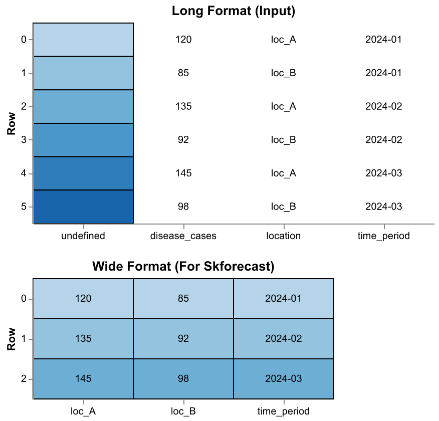
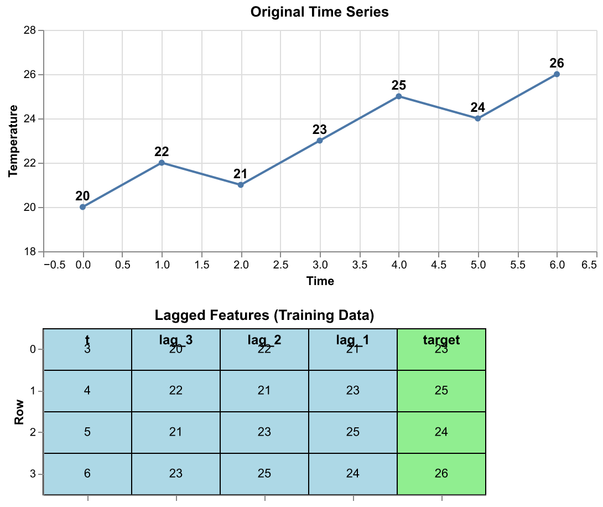
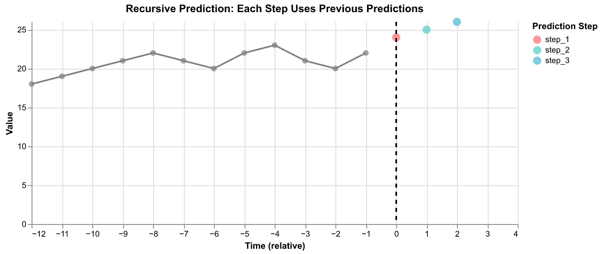
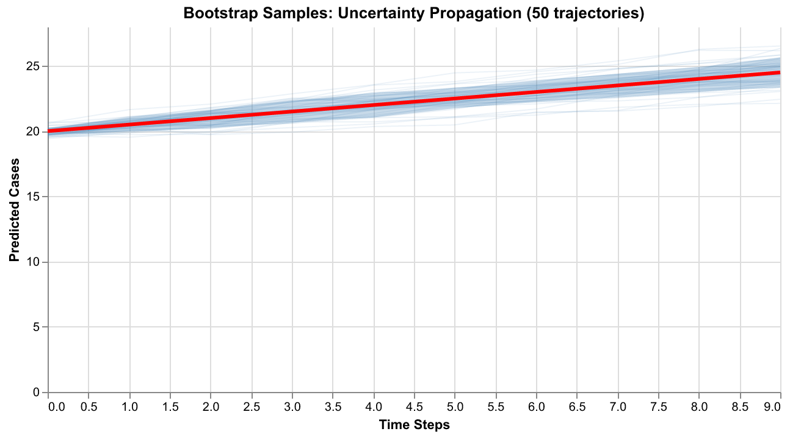

# Skforecast: Models and Data Transformations

This document describes the relationship between models and data transformations in skforecast, with specific focus on the implementation in chap-python-sdk.

## Table of Contents

- [Overview](#overview)
- [Architecture](#architecture)
- [Data Transformation Pipeline](#data-transformation-pipeline)
- [Model Wrapper Structure](#model-wrapper-structure)
- [Prediction Flow](#prediction-flow)
- [Configuration and Parameters](#configuration-and-parameters)
- [Code Examples](#code-examples)

## Overview

Skforecast transforms any scikit-learn regressor into a time series forecaster by:

1. **Data transformation**: Converting time series data into supervised learning format
2. **Model wrapping**: Wrapping sklearn regressors with forecasting capabilities
3. **Recursive prediction**: Generating multi-step forecasts by feeding predictions back as inputs
4. **Uncertainty quantification**: Using bootstrapping to create probabilistic forecasts

### Key Concept

```
Time Series     →  Lagged Features  →  Sklearn Model  →  Recursive Forecast  →  Samples
[20,22,21,23]      [lag-3,lag-2,lag-1]    RandomForest       [24,25,26]          (3×200)
```

## Quick Start Example

Here's a minimal example showing the complete pipeline:

```python notest
from chap_python_sdk.adaptors.skforecast import SkforecastConfig, SkforecastWrapper
from chap_python_sdk.adaptors.skforecast.data_transformer import (
    chapkit_to_wide,
    wide_to_chapkit,
)

# 1. Configure
config = SkforecastConfig(
    lags=12,
    model_class="sklearn.ensemble.RandomForestRegressor",
    model_params={"n_estimators": 100},
    n_samples=200,
)

# 2. Transform data (long → wide)
target_wide, exog_wide = chapkit_to_wide(
    data=training_data,
    target_variable="disease_cases",
)

# 3. Train
wrapper = SkforecastWrapper(config)
wrapper.fit(target_wide, exog_wide)

# 4. Predict with uncertainty
predictions_wide = wrapper.predict_samples(
    steps=3,
    exog_future=None,
    n_samples=200,
)  # Returns: dict[location → DataFrame(3 steps, 200 samples)]

# 5. Convert back (wide → long)
result = wide_to_chapkit(predictions_wide, future_data)
# Returns: DataFrame with [time_period, location, samples]
```

**Result**: 200 probabilistic trajectories for each location, capturing uncertainty that widens over time.

## Architecture

The chap-python-sdk implementation consists of three main components:

```
┌─────────────────────────────────────────────────────────────────┐
│                    Skforecast Adaptor                           │
├─────────────────────────────────────────────────────────────────┤
│                                                                 │
│  ┌────────────────┐   ┌────────────────┐   ┌───────────────┐  │
│  │ DataTransformer│   │SkforecastWrapper│  │   Sampling    │  │
│  │                │   │                 │   │               │  │
│  │ • chapkit→wide │   │ • Forecaster   │   │ • Bootstrap   │  │
│  │ • wide→chapkit │   │ • Fit/Predict  │   │ • Residuals   │  │
│  │ • Pivot ops    │   │ • Model wrap   │   │ • Trajectories│  │
│  └────────────────┘   └────────────────┘   └───────────────┘  │
│         ↓                     ↓                     ↓          │
│  ┌──────────────────────────────────────────────────────────┐  │
│  │            ForecasterRecursiveMultiSeries                │  │
│  │                    (from skforecast)                     │  │
│  └──────────────────────────────────────────────────────────┘  │
└─────────────────────────────────────────────────────────────────┘
```

### Component Responsibilities

| Component | Purpose | Key Methods |
|-----------|---------|-------------|
| **DataTransformer** | Format conversion between chapkit and skforecast | `chapkit_to_wide()`, `wide_to_chapkit()` |
| **SkforecastWrapper** | Model lifecycle management | `fit()`, `predict_samples()` |
| **Sampling** | Probabilistic forecasting | `bootstrap_recursive_samples()` |
| **Config** | Parameter management | Lags, model params, encoding |

## Data Transformation Pipeline

### 1. Input Format: Chapkit Long Format

Chapkit uses long format with columns `[time_period, location, disease_cases, ...]`:

```
time_period  location  disease_cases  rainfall  temperature
2024-01-01   loc_A     120           50        25
2024-01-01   loc_B     85            45        26
2024-02-01   loc_A     135           60        24
2024-02-01   loc_B     92            55        25
```

### 2. Transform: Wide Format for Skforecast

Skforecast requires wide format with DatetimeIndex and columns per location:

**Target (disease_cases):**
```
time_period    loc_A  loc_B
2024-01-01     120    85
2024-02-01     135    92
2024-03-01     145    98
```

**Exogenous (rainfall_location, temperature_location):**
```
time_period    rainfall_loc_A  rainfall_loc_B  temperature_loc_A  temperature_loc_B
2024-01-01     50              45              25                 26
2024-02-01     60              55              24                 25
2024-03-01     55              50              26                 27
```

### 3. Transformation Code

```python notest
def chapkit_to_wide(
    data: DataFrame,
    target_variable: str = "disease_cases",
    exogenous_variables: list[str] | None = None,
) -> tuple[pd.DataFrame, pd.DataFrame | None]:
    """Convert chapkit long format to pandas wide format."""
    df = data.to_pandas()
    df["time_period"] = pd.to_datetime(df["time_period"])

    # Pivot target by location
    target_wide = df.pivot(
        index="time_period",
        columns="location",
        values=target_variable
    )

    # Pivot exogenous variables (if any)
    if exogenous_variables:
        exog_dfs = []
        for var in exogenous_variables:
            var_wide = df.pivot(
                index="time_period",
                columns="location",
                values=var
            )
            # Rename: var_location
            var_wide.columns = [f"{var}_{col}" for col in var_wide.columns]
            exog_dfs.append(var_wide)
        exog_wide = pd.concat(exog_dfs, axis=1)

    return target_wide, exog_wide
```

### 4. Visual Illustration



*Figure 1: Long format (chapkit) to wide format (skforecast) transformation*

### 5. Transformation Table

| Transformation | Input Shape | Output Shape | Purpose |
|----------------|-------------|--------------|---------|
| **chapkit_to_wide** | (n_times × n_locs, cols) | (n_times, n_locs) | Prepare for skforecast |
| **pivot target** | Long format | Wide with loc columns | Target variable |
| **pivot exogenous** | Long format | Wide with var_loc columns | Covariates |
| **wide_to_chapkit** | dict[loc → (steps, samples)] | (n_times × n_locs, 3) | Convert predictions back |

## Model Wrapper Structure

### ForecasterRecursiveMultiSeries

Skforecast's main forecaster for multiple time series:

```python notest
from skforecast.recursive import ForecasterRecursiveMultiSeries

forecaster = ForecasterRecursiveMultiSeries(
    regressor=sklearn_model,      # Any sklearn regressor
    lags=12,                       # Use last 12 values
    encoding="onehot",             # Location encoding
)

forecaster.fit(series=target_wide, exog=exog_wide)
predictions = forecaster.predict(steps=3, levels=["loc_A", "loc_B"])
```

### How Lag Features Work

Skforecast automatically converts time series into supervised learning format by creating lagged features:



*Figure 2: Time series transformed into lagged features for supervised learning. Original series is converted into rows with past values (lags) as features and next value as target.*

**Key insights:**
- With `lags=3`, features are `[y[t-3], y[t-2], y[t-1]]` predicting `y[t]`
- First `max(lags)` observations are lost (needed for history)
- Each row represents one training example
- Target column (green) is what we're predicting
- Feature columns (blue) are the inputs to the model

### SkforecastWrapper Implementation

The wrapper manages the forecaster lifecycle:

```python notest
class SkforecastWrapper:
    def __init__(self, config: SkforecastConfig):
        self.config = config
        self.forecaster = None
        self.residuals_by_location = {}

    def fit(self, target_wide: pd.DataFrame, exog_wide: pd.DataFrame | None):
        # 1. Create sklearn model from config
        model_class = _import_class(self.config.model_class)
        regressor = model_class(**self.config.model_params)

        # 2. Instantiate ForecasterRecursiveMultiSeries
        self.forecaster = ForecasterRecursiveMultiSeries(
            regressor=regressor,
            lags=self.config.lags,
            encoding=self.config.encoding,
        )

        # 3. Fit on wide format data
        self.forecaster.fit(series=target_wide, exog=exog_wide)

        # 4. Compute residuals for bootstrapping
        if self.config.use_bootstrapping:
            self._compute_residuals(target_wide, exog_wide)
```

### Key Parameters

| Parameter | Type | Purpose | Example |
|-----------|------|---------|---------|
| **lags** | int \| list[int] | Historical values to use | `12` or `[1,2,3,6,12]` |
| **encoding** | str | How to encode locations | `"onehot"`, `"ordinal"` |
| **model_class** | str | Sklearn model to use | `"sklearn.ensemble.GradientBoostingRegressor"` |
| **model_params** | dict | Model hyperparameters | `{"n_estimators": 100, "max_depth": 3}` |
| **differentiation** | int \| None | Order of differencing | `1` (first difference) |
| **transformer_series** | str \| None | Preprocessing transformer | `"StandardScaler"` |

## Prediction Flow

### 1. Point Prediction (Deterministic)

```
┌──────────────┐
│ Historical   │  Last 12 values per location
│ Data (12)    │
└──────┬───────┘
       │
       ├─────► [Extract lags: y[-1], y[-2], ..., y[-12]]
       │
       ├─────► [Add location encoding (onehot)]
       │
       ├─────► [Add exogenous variables if available]
       │
       ▼
┌──────────────┐
│ Feature      │  Shape: (1, n_features)
│ Vector X     │  Features: [lags + encoding + exog]
└──────┬───────┘
       │
       ▼
┌──────────────┐
│ Sklearn      │  E.g., GradientBoostingRegressor
│ Model        │  Predict: ŷ = model.predict(X)
└──────┬───────┘
       │
       ▼
┌──────────────┐
│ Prediction   │  Single point estimate
│ ŷ₁           │
└──────────────┘
```

### 2. Recursive Prediction (Multi-step)

For `steps=3`, predict one step at a time, feeding predictions back:

```
Step 1:  history=[y₋₁₂,...,y₋₁]  →  predict  →  ŷ₁
Step 2:  history=[y₋₁₁,...,ŷ₁]   →  predict  →  ŷ₂
Step 3:  history=[y₋₁₀,...,ŷ₂]   →  predict  →  ŷ₃
```

**Visualization:**

```
Time:     t-12  ...  t-1  │  t   t+1  t+2
          ──────────────────┼─────────────
History:  [observed vals]  │
                           │
Step 1:                    │  ŷ₁
                           │   ↓
Step 2:                    │  [ŷ₁] → ŷ₂
                           │           ↓
Step 3:                    │  [ŷ₁,ŷ₂] → ŷ₃
```



*Figure 3: Recursive prediction process. Historical observations (gray) are used to predict the first step (red). Then predictions are fed back as features for subsequent steps (cyan, blue).*

### 3. Probabilistic Prediction (Bootstrap Sampling)

Generate multiple trajectories by sampling residuals at each step:

```python notest
def bootstrap_recursive_samples(
    forecaster,
    residuals_by_location,
    n_steps,
    n_samples,
    exog_future,
    locations,
):
    """Generate n_samples probabilistic trajectories."""
    results = {}

    for location in locations:
        samples = np.zeros((n_steps, n_samples))

        for sample_idx in range(n_samples):
            # Each sample gets its own trajectory
            for step in range(n_steps):
                # 1. Predict mean
                pred_mean = forecaster.predict(
                    steps=1,
                    levels=[location]
                )[location].iloc[0]

                # 2. Sample residual
                residual = np.random.choice(
                    residuals_by_location[location]
                )

                # 3. Add to create sample
                sampled_value = pred_mean + residual
                samples[step, sample_idx] = sampled_value

                # 4. Update internal state with SAMPLED value
                # (This creates trajectory branching)

        results[location] = pd.DataFrame(samples)

    return results
```

### 4. Prediction Flow Diagram

```
┌────────────────────────────────────────────────────────────────┐
│                     Probabilistic Forecasting                  │
├────────────────────────────────────────────────────────────────┤
│                                                                │
│  Sample 1:  history → predict → sample residual → ŷ₁⁽¹⁾       │
│                       ↓ feed back                              │
│             history + ŷ₁⁽¹⁾ → predict → sample → ŷ₂⁽¹⁾        │
│                                          ↓ feed back           │
│                       history + ŷ₁⁽¹⁾ + ŷ₂⁽¹⁾ → ŷ₃⁽¹⁾         │
│                                                                │
│  Sample 2:  history → predict → sample residual → ŷ₁⁽²⁾       │
│                       ↓ feed back (different)                  │
│             history + ŷ₁⁽²⁾ → predict → sample → ŷ₂⁽²⁾        │
│                                          ↓ feed back           │
│                       history + ŷ₁⁽²⁾ + ŷ₂⁽²⁾ → ŷ₃⁽²⁾         │
│                                                                │
│  ...                                                           │
│                                                                │
│  Sample 200: Similar process                                  │
│                                                                │
│  Result:                                                       │
│  ┌──────┬───────────────────────────────────┐                 │
│  │ Step │        200 Samples                │                 │
│  ├──────┼───────────────────────────────────┤                 │
│  │  1   │ [ŷ₁⁽¹⁾, ŷ₁⁽²⁾, ..., ŷ₁⁽²⁰⁰⁾]      │                 │
│  │  2   │ [ŷ₂⁽¹⁾, ŷ₂⁽²⁾, ..., ŷ₂⁽²⁰⁰⁾]      │                 │
│  │  3   │ [ŷ₃⁽¹⁾, ŷ₃⁽²⁾, ..., ŷ₃⁽²⁰⁰⁾]      │                 │
│  └──────┴───────────────────────────────────┘                 │
│                                                                │
└────────────────────────────────────────────────────────────────┘
```

### 5. Fan Chart: Uncertainty Propagation

Probabilistic trajectories create widening uncertainty intervals:

```
Cases
  │
40├                              ╱──────
  │                           ╱──────
35├                        ╱──────  90th percentile
  │                     ╱──────
30├                  ╱════════════  Median (50th)
  │               ╱──────
25├            ╱──────  10th percentile
  │         ╱──────
20├      ○──────  Historical
  │
  └────┼────┼────┼────┼────┼────
       t    t+1  t+2  t+3  t+4  Time
       │
       └─ Prediction starts here

  Narrow → → → → → Wide
  (uncertainty compounds)
```



*Figure 4: Bootstrap sampling creates multiple probabilistic trajectories. Each light blue line is one sample trajectory. The red line is the mean prediction. The shaded region shows the 10th-90th percentile range. Notice how uncertainty widens over time as predictions compound.*

## Configuration and Parameters

### SkforecastConfig Schema

```python notest
class SkforecastConfig(BaseConfig):
    """Configuration for skforecast adaptor."""

    lags: int | list[int] = 12
    n_samples: int = 200
    use_bootstrapping: bool = True
    exogenous_variables: list[str] | None = None
    model_class: str = "sklearn.ensemble.GradientBoostingRegressor"
    model_params: dict[str, Any] = {
        "n_estimators": 100,
        "max_depth": 3,
        "learning_rate": 0.1,
        "min_samples_leaf": 3,
        "random_state": 42,
    }
    encoding: str = "onehot"
    differentiation: int | None = 1
    transformer_series: str | None = "StandardScaler"
    refit_on_predict: bool = True
    n_prediction_steps: int = 3
```

### Configuration Reference Table

| Parameter | Values | Effect on Model | Effect on Data |
|-----------|--------|-----------------|----------------|
| **lags=12** | int | Uses last 12 observations | Creates 12 lag features |
| **lags=[1,3,6,12]** | list | Uses specific lags only | Creates 4 lag features |
| **encoding="onehot"** | str | Adds binary location indicators | +n_locations features |
| **encoding="ordinal"** | str | Adds single integer column | +1 feature |
| **differentiation=1** | int | Applies first differencing | y' = y[t] - y[t-1] |
| **transformer_series="StandardScaler"** | str | Standardizes each series | μ=0, σ=1 per location |
| **exogenous_variables=["rainfall"]** | list | Includes external predictors | +n_locs features per var |

### Model Selection Comparison

| Model Class | Speed | Interpretability | Nonlinearity | Best For |
|------------|-------|------------------|--------------|----------|
| **LinearRegression** | ⚡⚡⚡ | ⭐⭐⭐⭐⭐ | ❌ | Simple trends, baseline |
| **Ridge/Lasso** | ⚡⚡⚡ | ⭐⭐⭐⭐⭐ | ❌ | Regularized linear |
| **RandomForest** | ⚡⚡ | ⭐⭐⭐ | ✅ | Nonlinear, robust |
| **GradientBoosting** | ⚡⚡ | ⭐⭐ | ✅ | High accuracy |
| **XGBoost** | ⚡⚡⚡ | ⭐⭐ | ✅ | Production, speed |
| **LightGBM** | ⚡⚡⚡⚡ | ⭐⭐ | ✅ | Large datasets |

## Code Examples

### Example 1: Basic Usage

```python notest
from chap_python_sdk.adaptors.skforecast import SkforecastConfig, SkforecastWrapper
from chap_python_sdk.adaptors.skforecast.data_transformer import chapkit_to_wide

# Configure
config = SkforecastConfig(
    lags=12,
    model_class="sklearn.ensemble.RandomForestRegressor",
    model_params={"n_estimators": 100, "max_depth": 10},
)

# Transform data
target_wide, exog_wide = chapkit_to_wide(
    data=training_data,
    target_variable="disease_cases",
    exogenous_variables=["rainfall", "temperature"],
)

# Fit
wrapper = SkforecastWrapper(config)
wrapper.fit(target_wide, exog_wide)

# Predict with uncertainty
predictions = wrapper.predict_samples(
    steps=3,
    exog_future=future_exog_wide,
    n_samples=200,
)
# Returns: dict[location → DataFrame(steps, samples)]
```

### Example 2: Custom Lag Configuration

```python notest
# Use specific lags (1, 2, 3, 6, 12 months back)
config = SkforecastConfig(
    lags=[1, 2, 3, 6, 12],  # Seasonal pattern
)

# This creates 5 features per location instead of 12
```

### Example 3: Different Encodings

```python notest
# One-hot encoding (default)
config_onehot = SkforecastConfig(encoding="onehot")
# Features: [lags...] + [is_loc_A, is_loc_B, is_loc_C, ...]

# Ordinal encoding
config_ordinal = SkforecastConfig(encoding="ordinal")
# Features: [lags...] + [location_code]
```

### Example 4: With Transformers

```python notest
config = SkforecastConfig(
    transformer_series="StandardScaler",  # Standardize each series
    differentiation=1,  # First difference: y'[t] = y[t] - y[t-1]
)

# Applies transformations automatically:
# 1. Differentiation (if specified)
# 2. StandardScaler (if specified)
# 3. Inverse transform predictions back to original scale
```

### Example 5: Full Pipeline

```python notest
from chapkit.data import DataFrame

async def on_train(config, data, run_info, geo):
    """Train with skforecast."""
    from chap_python_sdk.adaptors.skforecast import SkforecastWrapper
    from chap_python_sdk.adaptors.skforecast.data_transformer import chapkit_to_wide

    # Transform
    target_wide, exog_wide = chapkit_to_wide(
        data,
        target_variable="disease_cases",
        exogenous_variables=config.exogenous_variables,
    )

    # Fit
    wrapper = SkforecastWrapper(config)
    wrapper.fit(target_wide, exog_wide)

    return wrapper

async def on_predict(config, model, historic, future, run_info, geo):
    """Predict with uncertainty."""
    from chap_python_sdk.adaptors.skforecast.data_transformer import (
        chapkit_to_wide,
        wide_to_chapkit,
    )

    # Prepare future exogenous
    _, exog_future = chapkit_to_wide(
        future,
        exogenous_variables=config.exogenous_variables,
    )

    # Predict
    predictions_wide = model.predict_samples(
        steps=config.n_prediction_steps,
        exog_future=exog_future,
        n_samples=config.n_samples,
    )

    # Convert back to chapkit format
    result = wide_to_chapkit(predictions_wide, future)

    return result
```

## Summary

### Data Flow Overview

```
┌─────────────────────────────────────────────────────────────────────┐
│                         Complete Pipeline                           │
├─────────────────────────────────────────────────────────────────────┤
│                                                                     │
│  Chapkit Long Format                                                │
│  [time, location, disease_cases, rainfall, temp]                    │
│                    ↓                                                │
│            chapkit_to_wide()                                        │
│                    ↓                                                │
│  Wide Format                                                        │
│  target: (time, [loc_A, loc_B, ...])                               │
│  exog: (time, [rain_A, rain_B, temp_A, temp_B, ...])               │
│                    ↓                                                │
│  ForecasterRecursiveMultiSeries                                     │
│  • Extract lags: [y[-1], y[-2], ..., y[-12]]                       │
│  • Add encoding: [is_A, is_B, ...]                                 │
│  • Add exog: [rain, temp]                                           │
│  • Fit sklearn model                                                │
│                    ↓                                                │
│  Predict (Recursive + Bootstrap)                                    │
│  For each sample (1..200):                                          │
│    For each step (1..3):                                            │
│      1. Predict mean                                                │
│      2. Sample residual                                             │
│      3. Add: prediction = mean + residual                           │
│      4. Feed back for next step                                     │
│                    ↓                                                │
│  Predictions Wide Format                                            │
│  dict[location → DataFrame(steps, samples)]                         │
│                    ↓                                                │
│            wide_to_chapkit()                                        │
│                    ↓                                                │
│  Chapkit Long Format                                                │
│  [time_period, location, samples]                                   │
│                                                                     │
└─────────────────────────────────────────────────────────────────────┘
```

### Key Takeaways

1. **Skforecast enables sklearn for time series**: Any sklearn regressor can be used
2. **Data transformation is critical**: Long ↔ Wide format conversion
3. **Recursive prediction**: Predictions feed back as inputs for multi-step forecasts
4. **Bootstrap uncertainty**: Residual sampling creates probabilistic trajectories
5. **Location encoding**: Multiple series handled via encoding features
6. **Modular design**: Separate concerns (transform, fit, sample, convert back)

### Pipeline Summary Table

| Stage | Input | Transformation | Output | Figure |
|-------|-------|----------------|--------|--------|
| **1. Data Prep** | Chapkit long format<br>`(n×m, cols)` | `chapkit_to_wide()` | Wide format<br>`(n_times, n_locs)` | Fig 1 |
| **2. Feature Engineering** | Time series<br>`[20,22,21,23,...]` | Create lag features<br>`lags=[1,2,3]` | Feature matrix<br>`[lag-3, lag-2, lag-1] → target` | Fig 2 |
| **3. Model Training** | Features + labels | `ForecasterRecursiveMultiSeries.fit()` | Fitted model + residuals | - |
| **4. Recursive Prediction** | History (last 12 obs) | Predict → feed back → predict | Multi-step forecast<br>`[ŷ₁, ŷ₂, ŷ₃]` | Fig 3 |
| **5. Bootstrap Sampling** | Fitted model + residuals | Sample residuals at each step<br>`n_samples=200` | Trajectories<br>`(n_steps, n_samples)` | Fig 4 |
| **6. Format Conversion** | Dict[loc → DataFrame] | `wide_to_chapkit()` | Chapkit long format<br>`[time, loc, samples]` | - |

### Visual Reference Guide

| Figure | Shows | Key Insight |
|--------|-------|-------------|
| **Figure 1** | Long → Wide transformation | Data must be pivoted by location for skforecast |
| **Figure 2** | Lag feature creation | Time series becomes supervised learning with past values as features |
| **Figure 3** | Recursive prediction steps | Predictions feed back as inputs for multi-step forecasting |
| **Figure 4** | Bootstrap uncertainty | Multiple trajectories create widening prediction intervals |

## References

- [Skforecast Documentation](https://skforecast.org/)
- [Data Transformation Guide](https://skforecast.org/0.14.0/user_guides/sklearn-transformers-and-pipeline.html)
- [Probabilistic Forecasting](https://skforecast.org/0.14.0/user_guides/probabilistic-forecasting.html)
- [ForecasterRecursiveMultiSeries API](https://skforecast.org/0.7.0/api/forecasterrecursivemultiseries)

---

*Document created: 2026-02-10*
